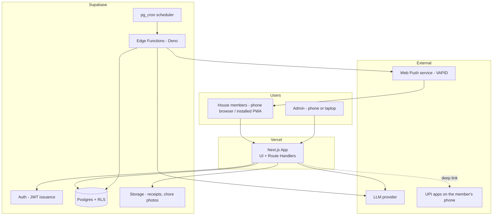
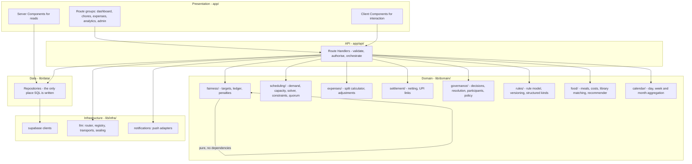
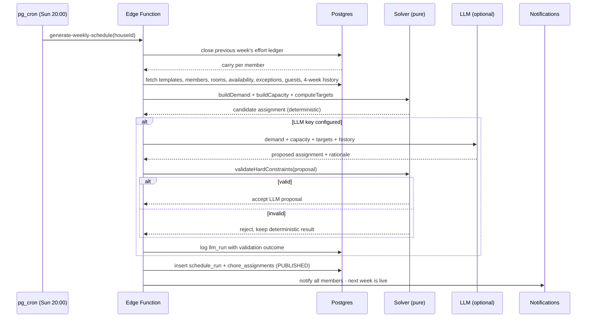
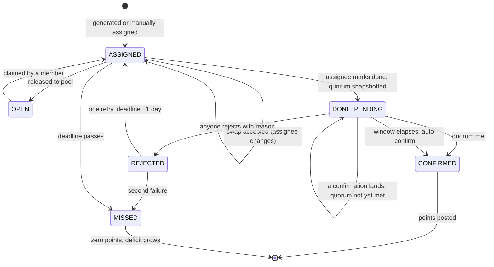
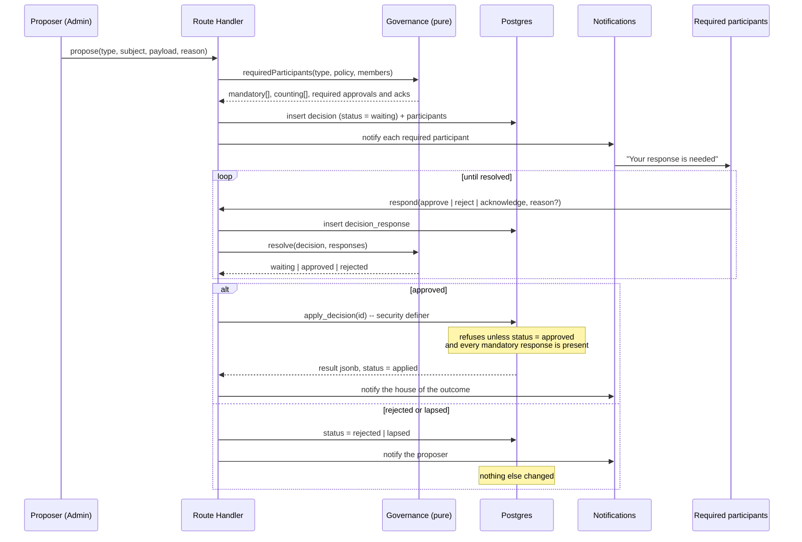
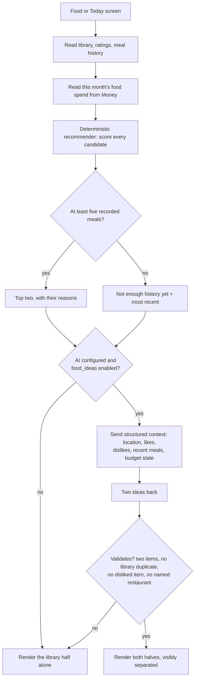
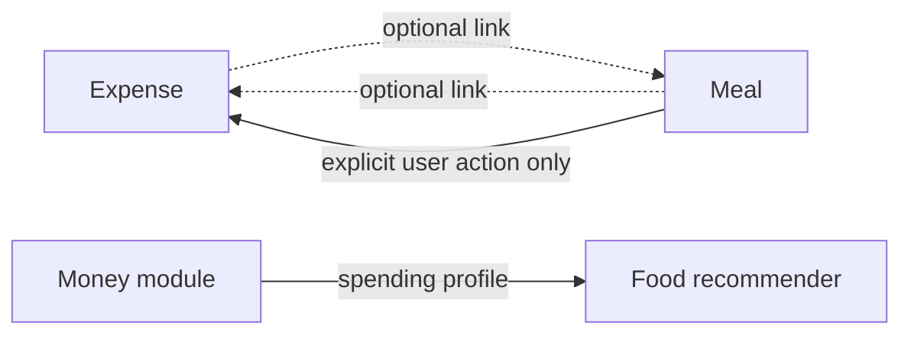
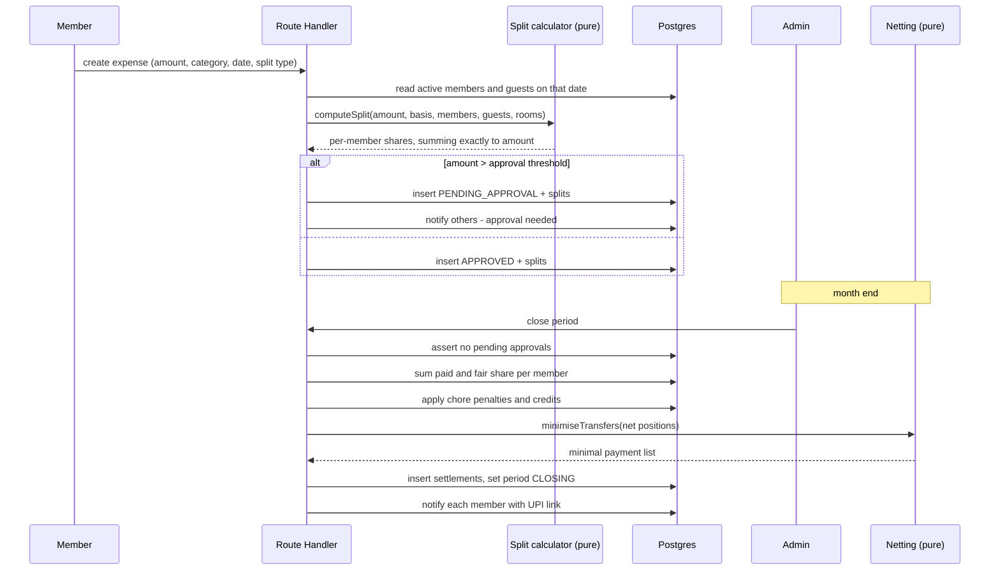

# 03 — Architecture

**Product:** HouseOS
**Version:** 2.0
**Date:** 2026-08-27
**Depends on:** [01-BRD.md](01-BRD.md) v2.0, [02-TRD.md](02-TRD.md) v2.0

---

## 1. Architectural principles

Seven principles drive every decision below. The first five are unchanged from
version 1.0; the last two are what version 2.0 adds.

1. **The database is the authority.** Home isolation, immutability of closed periods, the self-confirmation ban and the refusal to apply an unapproved decision are enforced in Postgres by policies, constraints and triggers. Application code that forgets a check cannot cause a leak or a corruption.
2. **Domain logic is pure and separate.** The fairness engine, split calculator, netting algorithm, decision resolver, quorum calculator and food recommender are pure functions taking plain data and returning plain data. They do not know that a database exists. This makes them trivially testable and is the reason correctness is achievable by one person.
3. **Everything schedulable runs in the database's own scheduler.** No external cron service, no reliance on a hosting tier's job limits.
4. **The LLM is an optional advisor, never a dependency.** Remove the key and the product still works completely.
5. **One codebase, one deployment.** Next.js serves the UI and the API. Supabase serves data, auth, storage and jobs. There is no third moving part.
6. **One decision engine, not eight approval flows.** Every shared decision — settlement close, member removal, rule change, absence, join request, expense approval, chore confirmation, balance adjustment — is the same record with different participants. A second implementation of "somebody else's yes" is a defect, not a feature.
7. **Proposal and effect are separate steps, always.** A model proposes and a validator disposes. A person proposes and the Home decides. A decision is approved in one transaction and applied in another. Nothing in this system goes from suggestion to fact in one move.

---

## 2. System context



---

## 3. Application layers



**The dependency rule:** arrows point inward and downward only. `lib/domain/` imports nothing from `lib/data/`, `lib/infra/` or `app/`. If a domain function needs data, the caller fetches it and passes it in.

**The one intra-domain rule:** `governance/` may be imported by any other domain module, and imports none of them. It knows about decisions, participants and responses; it does not know what a settlement or a rule is. The caller supplies the participants and receives a resolution.

---

## 4. Module boundaries

Twelve modules. Each owns its tables, its domain logic and its routes.

| Module | Owns | Depends on | Public interface |
|--------|------|-----------|------------------|
| **Home** | houses, house_members, rooms, room_assignments, house_settings, invitations, join_requests | — | `getHome`, `getActiveMembers(date)`, `getRoomOccupancy(date)`, `getMyHomes` |
| **Governance** | decisions, decision_participants, decision_responses, governance_policy | Home | `propose`, `respond`, `resolve`, `apply`, `requiredParticipants(type)` |
| **Rules** | home_rules, home_rule_versions | Home, Governance | `proposeRule`, `activateVersion`, `listActive`, `history(ruleId)` |
| **Availability** | member_availability, availability_exceptions, absence_requests, guests | Home, Governance | `getFreeWindows(memberIds, dateRange)`, `getPresence(dateRange)`, `requestAbsence` |
| **Chores** | chore_templates, chore_assignments, schedule_runs, swap_requests, chore_confirmations | Home, Availability, Governance | `generateWeek(houseId, weekStart)`, `markDone`, `confirm`, `reject`, `quorumFor(houseId)` |
| **Effort** | effort_ledger, chore_penalties | Chores, Home | `computeTargets(week)`, `closeWeek(week)`, `computePenalties(period)` |
| **Money** | expenses, expense_splits, expense_categories, recurring_expenses, balance_adjustments | Home, Availability, Governance | `createExpense`, `approveExpense`, `computeSplit`, `computeBalances`, `netPairwise` |
| **Settlement** | monthly_periods, member_period_balances, settlements | Money, Effort, Home, Governance | `proposeClose`, `applyClose`, `proposeReopen`, `markPaid`, `confirmReceived` |
| **Food** | foods, meals, meal_items, meal_participants, food_preferences | Home | `createMeal`, `matchLibrary`, `recommendFromLibrary`, `preferenceFor` |
| **Calendar** | nothing | Chores, Money, Food, Availability, Governance | `day(date)`, `week(weekStart)`, `month(period)` |
| **Insights** | nothing | Money, Effort, Food, Governance | `money`, `chores`, `food`, `home`, `export` |
| **Notifications** | push_subscriptions, notification_prefs, notifications | All (as an observer) | `notify(memberId, type, payload)` |

Five dependency rules keep the graph acyclic:

- **Settlement depends on Effort, never the reverse.** Chore penalties flow into money; money never flows back into effort accounting.
- **Governance depends only on Home.** Every other module depends on Governance. It is the one module that must never learn what a settlement or a rule is, because the moment it does there are two of it.
- **Food reads Money and never writes it.** The recommender takes a budget position as an input. An expense is created from a meal only by an explicit user action through the Money module's own path.
- **Calendar and Insights own no tables.** They are read compositions over other modules. If either acquires a table, something has been modelled in the wrong place.
- **Notifications is a sink.** Nothing depends on it. Any module may call `notify`; no module reads notification state.

---

## 5. Core data flows

### 5.1 Weekly schedule generation



The deterministic solver always runs, even when the LLM is available. It costs milliseconds and guarantees a usable fallback exists before any external call is made.

### 5.2 Chore lifecycle



Points post exactly once, on the transition into `CONFIRMED`. Nothing else moves the effort ledger.

The quorum — one other person, or an Admin/Co-Admin plus one or two others,
depending on Home size — is computed and stored on the row when the chore is
marked done, so that a member joining or leaving mid-window cannot move the
requirement. A single rejection ends the quorum immediately. Auto-confirm applies
at every Home size, because a quorum that includes an Admin and has no timeout
hands every Admin a veto over everyone else's points.

### 5.4 A shared decision, start to finish



Two things this diagram is drawn to make obvious. The **effect is never applied
in the same statement that collects the last response** — resolution and
application are separate transitions, so a decision can be approved and still
fail to apply when the world has moved underneath it. And the **database is the
last line**, not the route handler: `apply_decision` re-checks the mandatory
responses itself, because the whole point of the module is that no single caller
can complete a Critical decision alone.

### 5.5 A food suggestion



The library half is computed first and never depends on the AI half. A model
failure, a rejected key or a validation failure removes two lines from a card;
it does not produce an error and it does not leave the screen empty.

### 5.6 Food and Money, deliberately loose



Nothing in the expense path reads the food tables, so the ten-second entry flow
stays ten seconds. Nothing in the food path writes an expense without a tap.
Deleting either side of a link leaves the other intact — the foreign keys are
nullable in both directions and neither cascades.

### 5.3 Expense to settlement



---

## 6. Directory structure

```
/
├─ docs/                        # this documentation set
├─ app/
│  ├─ (auth)/                   # sign in, sign up, invite link landing
│  ├─ (app)/
│  │  ├─ home/                  # the Home overview
│  │  ├─ today/                 # the operational screen
│  │  ├─ chores/                # week view, my chores, confirmations
│  │  ├─ money/                 # list, add, balances, settle
│  │  ├─ food/                  # add meal, library, history, preferences
│  │  ├─ insights/              # one screen, filtered
│  │  ├─ more/
│  │  │  ├─ members/            # members, requests, rooms, guests
│  │  │  ├─ calendar/           # day, week, month
│  │  │  ├─ approvals/          # the single approvals surface
│  │  │  ├─ rules/              # list, edit, history
│  │  │  ├─ categories/
│  │  │  ├─ history/            # the activity log
│  │  │  └─ settings/           # home, governance, ai
│  │  └─ homes/                 # my Homes, switch, create
│  └─ api/
│     ├─ houses/                # create, join request, switch, settings
│     ├─ members/               # accept, role, removal proposal
│     ├─ decisions/             # propose, respond, list, apply
│     ├─ approvals/             # the aggregated queue, approve-all
│     ├─ rules/                 # propose, edit, disable, history, parse
│     ├─ chores/                # mark-done, confirm, reject, swap, claim
│     ├─ absences/              # request, respond
│     ├─ expenses/              # create, approve, void
│     ├─ adjustments/           # balance adjustments, via governance
│     ├─ periods/               # close, reopen, settle
│     ├─ food/                  # meals, library, preferences, suggestions
│     ├─ calendar/              # day, week, month
│     ├─ insights/              # money, chores, food, home, export
│     ├─ availability/
│     ├─ guests/
│     ├─ notifications/         # feed, prefs, devices
│     └─ ai/                    # providers, credentials, parse, digest, ideas
├─ lib/
│  ├─ domain/
│  │  ├─ fairness/              # targets.ts, ledger.ts, penalties.ts
│  │  ├─ scheduling/            # demand.ts, capacity.ts, constraints.ts, solver.ts, quorum.ts
│  │  ├─ governance/            # decision.ts, resolve.ts, participants.ts, policy.ts
│  │  ├─ rules/                 # model.ts, versioning.ts, kinds.ts
│  │  ├─ expenses/              # split.ts, adjust.ts
│  │  ├─ settlement/            # netting.ts, upi.ts
│  │  ├─ food/                  # cost.ts, library.ts, preference.ts, recommend.ts
│  │  ├─ calendar/              # aggregate.ts
│  │  └─ analytics/             # insights transformers, csv.ts
│  ├─ data/                     # one repository file per module
│  ├─ infra/                    # supabase.ts, llm/, push/
│  ├─ types/                    # generated database types + domain types
│  └─ utils/                    # money.ts, date.ts (house-timezone aware)
├─ supabase/
│  ├─ migrations/               # numbered SQL migrations
│  ├─ functions/                # edge functions, one folder per job (8 + _shared)
│  └─ seed.sql                  # a demo house for development
├─ components/                  # ui/ (shadcn) + feature components
├─ public/                      # icons and service worker; manifest is app/manifest.ts
└─ tests/                       # unit, integration, e2e
```

### The scheduled jobs, as deployed

Everything schedulable is a `pg_cron` entry. Fourteen jobs exist: eight call an
Edge Function through the `call_edge` helper, five call a database function
directly, and one is a keep-alive. `call_edge` reads the project URL and service-role key from the
`app_config` table — not from a database setting, which needs superuser and is
unavailable on hosted Supabase (04-DATABASE §4.1).

All cron expressions are **UTC**; the comment column gives the Asia/Kolkata
equivalent for the reference Home.

| Cron job | Schedule (UTC) | Calls | What it does |
|---|---|---|---|
| `post-recurring` | `30 0 * * *` | `post-recurring-expenses` | Posts due recurring expenses (06:00 IST) |
| `close-effort-week` | `5 14 * * 0` | `close-effort-week` | Closes the effort week and rolls carry forward |
| `generate-weekly` | `35 14 * * 0` | `generate-weekly-schedule` | Runs the solver and publishes next week |
| `auto-confirm` | `*/30 * * * *` | `auto-confirm-chores` | Moves `done_pending` to `confirmed` once the window elapses |
| `mark-missed` | `25 18 * * *` | `mark-missed-chores` | Marks the day's unmet assignments missed |
| `dispatch-notifications` | `*/15 * * * *` | `dispatch-notifications` | Sends what is due, coalescing against the volume cap |
| `schedule-chore-reminders` | `30 23 * * *` | `schedule-chore-reminders` | Enqueues tomorrow's reminders at each member's own free window |
| `weekly-digest` | `30 15 * * 0` | `weekly-digest` | Builds and sends the Sunday digest |
| `escalate-missed` | `10 * * * *` | `escalate_missed_chores()` | Private for two hours, then visible to the Home |
| `warn-deficits` | `30 13 * * 5` | `warn_deficits()` | Friday warning to members heading into a deficit |
| `budget-alerts` | `30 14 * * *` | `check_budget_thresholds()` | Category budget breaches, on the day they happen |
| `settlement-reminders` | `30 4 * * *` | `remind_outstanding_settlements()` | Unpaid settlement nudges |
| `prune-notifications` | `30 21 1 * *` | `prune_notifications()` | Deletes feed rows older than 90 days |
| `heartbeat` | `0 3 * * 1` | `select 1` | Keeps a free-tier project from pausing after 7 idle days (02-TRD §2.2) |

Every job is idempotent: the next run corrects the state rather than compounding
the failure, which is why none of them has a retry queue.

Two rules about this tree:

- **No business logic in `app/`.** Route handlers validate input, check authorisation, call domain functions and repositories, and return. If a route handler contains arithmetic about points or money, it is in the wrong place.
- **SQL exists only in `lib/data/` and `supabase/migrations/`.** Nowhere else.

---

## 7. Authorisation model

Three layers, deliberately redundant.

**Layer 1 — Row Level Security.** Every house-scoped table carries a policy of the form: the requesting user must have an **active** `house_members` row for this row's `house_id`. This is the layer that guarantees Home isolation, and it is also what makes `requested` and `inactive` mean what version 2.0 says they mean — a person in either state is a non-member for every read, in every table, with no separate code path.

**Layer 2 — Role policies.** Tables that only an Admin may write (`house_settings`, `governance_policy`) require `role = 'admin'`. Tables an Admin or Co-Admin may write (`chore_templates`, `rooms`, `expense_categories`, `foods`) require `role in ('admin', 'co_admin')`.

**Layer 3 — Constraints and triggers.** Rules that are neither about identity nor about role:

- `confirmed_by <> assignee_member_id` — a check constraint on the assignment, and the same rule again on every row of `chore_confirmations`. Self-confirmation is impossible however many confirmations a Home requires.
- `approved_by <> paid_by_member_id` — a check constraint. Self-approval is impossible.
- A decision's subject is not one of its participants — a check on `decision_participants`.
- `apply_decision` refuses any decision not in `approved`, and refuses the transition when a mandatory participant has not responded.
- A `home_rule_versions` row with `activated_at` set and `decision_id` null is refused. A rule cannot become active without a decision behind it.
- A trigger rejecting any write to an expense whose period is `CLOSED`.
- A trigger rejecting an `expense_splits` set that does not sum to its expense amount.
- A trigger rejecting a `meal_participants` set whose per-person shares do not sum to the meal's total.

The application layer repeats these checks for good error messages. It is never the only place they exist. Layer 3 is where version 2.0 puts most of its new weight, because "the Admin cannot do this alone" is a claim that has to survive somebody writing a maintenance script in a hurry.

---

## 8. Offline and PWA behaviour

| Concern | Approach |
|---------|----------|
| App shell | Precached by the service worker; the app opens instantly with no network. |
| Reads | The current week's schedule and the current month's expenses are cached stale-while-revalidate. |
| Writes | Mutations are not queued by the current service worker. An offline mutation fails honestly and the UI keeps the user on the record so it can be retried. An IndexedDB mutation queue is a future feature and must not be assumed by clients. |
| Reporting success | **The interface never reports a record as saved before the server has confirmed the write** (NFR-20). There is no optimistic "saved" state on an unconfirmed mutation, offline or online. This is the deliberate reason the write queue is not built yet: a queue that can lose or double-post an expense is worse than a failure the member can see. |
| Conflicts | No offline mutation replay exists today. If a future queue is added, it needs an explicit idempotency and conflict contract before being enabled, and it must preserve NFR-20: a queued entry is shown as pending, never as saved, until the server confirms it. |
| Install | A web app manifest with maskable icons. The app prompts for installation after the third visit, not on the first. |
| Push | Requested at the end of onboarding, with an explanation of what will be sent — never on first page load. |

---

## 9. Error handling

| Failure | Behaviour |
|---------|-----------|
| Schedule generation finds an unassignable chore | The chore is created in the open pool, generation completes, and the admin is notified. Generation never aborts wholesale. |
| LLM call fails, times out or returns invalid JSON | Silently falls back to the deterministic result. Logged in `llm_runs`. No user-visible error. |
| Push delivery returns 410 Gone | That subscription is deleted after the batch. The member's other devices are unaffected and the notification remains in the in-app feed. |
| An Edge Function job fails midway | Every job is idempotent and transactional. The next scheduled run corrects the state. |
| A split does not sum to its amount | The transaction is rejected by a trigger. This is a bug, not a user error, and must surface loudly in development. |
| A member tries to close a period with pending approvals | Blocked, with the list of blocking expenses shown. Blocked before a decision is even proposed, so the Home is not asked to acknowledge something that cannot happen. |
| A decision collects every response but its effect no longer applies | It resolves `approved` and then fails to apply. Both facts are recorded, the proposer is notified with the specific reason, and nothing is half-done — the apply runs in one transaction. |
| A required participant never responds | The decision lapses at its deadline, takes no effect, and is kept. The proposer may re-propose. There is no automatic majority override. |
| A rule parse returns nonsense | It is a proposal on a form. A person edits or discards it. Nothing reaches `home_rules` without a person submitting and the Home approving. |
| The food recommender has almost no data | It says so and shows recent meals instead of a fabricated ranking. It never hands the slot to AI to fill the gap. |
| An AI food idea names a restaurant, duplicates the library, or returns one item | The whole AI half is dropped. The library half renders alone. No error is shown. |
| A write fails, times out, or the device is offline | The entry is not reported as saved. The values the member typed stay on the form, the failure is named, and the action stays retryable. Nothing is discarded and nothing is silently queued (NFR-20). |
| A member is removed while money is outstanding | The removal is approved but not completed. They become `Inactive`, flagged, and the daily job completes it when they are clear. |

---

## 10. Deployment

| Environment | Frontend | Database | Purpose |
|-------------|----------|----------|---------|
| Local | `next dev` | Local Supabase via CLI | Development, migration authoring, seeded demo house |
| Preview | Vercel preview per branch | Shared staging Supabase project | Review before merge |
| Production | Vercel, main branch | Production Supabase project | The live house |

Migrations are numbered SQL files applied through the Supabase CLI. They run forward only; a mistake is corrected by a new migration, never by editing an applied one.

Product phase 2 adds mobile release environments and credentials rather than
changing the web deployment shape: Android package/signing and Play Console
configuration, iOS bundle/signing and App Store Connect configuration, native
push provider credentials, and verified universal/app-link redirects. Those
artifacts must be secret-managed and verified before store release.

---

## 11. Architectural decisions and their alternatives

| Decision | Chosen | Rejected alternative | Reason |
|----------|--------|---------------------|--------|
| Enforcement location for isolation | Postgres RLS | Application middleware | A single forgotten check in middleware leaks another house's finances. A policy cannot be forgotten per-query. |
| Scheduling | `pg_cron` in Supabase | Vercel Cron | Hobby-tier cron frequency is too coarse for hourly reminders. |
| Native app timing | Web/PWA product phase 1, native Android/iOS product phase 2 | Both from day one | The web product validates household behaviour first; native clients then consume a stable API. |
| Native push | Provider-neutral registration and adapter; web uses Web Push/VAPID, native uses platform push providers | Reuse the browser endpoint and VAPID payload unchanged | Browser and native push lifecycles and credentials differ; hiding that difference would make delivery and token rotation unreliable. |
| Fairness engine | Deterministic solver with optional LLM overlay | LLM-only | A schedule that silently violates availability destroys trust in the whole product. The rule engine is the guarantee. |
| Money representation | Integer paise | Numeric or float rupees | Settlement must net to exactly zero. Floating point makes that untrue eventually. |
| Split basis | Flat equal across active members | Presence-weighted per expense | Chosen by the product owner. Simpler to explain, and an explanation everyone accepts matters more than marginal accuracy. Guests and rent are the two deliberate exceptions. |
| Late expense default | Carry forward as a tagged adjustment | Always reopen | Reopening a settled month reopens the argument that closing it ended. The admin can still reopen when the amount justifies it. |
| Confirmation | Size-aware quorum with an auto-confirm window | Strict mandatory peer confirm, or one peer at every size | Without a timeout, non-participation becomes a veto on other people's points — the exact failure mode the product exists to fix. Without size-awareness, a two-person Home needs signatures it cannot produce and an eight-person Home is confirmed by whoever is nearest. |
| Shared decisions | One generic Decision record with per-type participants | A bespoke approval flow per feature | Eight flows become eight meanings of "approved" and eight places to forget the self-exclusion rule. |
| Approval versus acknowledgement | Two distinct response kinds | Approval everywhere | Requiring a veto-capable yes from everyone for everything makes the product unusable, and requiring nothing makes it one person's app. |
| Decision application | A separate `apply` step behind a `security definer` function | Applying the effect in the statement that collects the last response | The effect must be able to fail without losing the record that the Home agreed to it, and the database has to be the thing that refuses an unapproved apply. |
| Rules | Plain text stored verbatim, plus a parsed structure a person owns | AI-generated rules applied directly, or a checkbox configuration screen | A rule the Home did not write in its own words is not the Home's rule. A rule a model activated is not a decision anyone made. |
| Food modelling | A named Meal with items, source, costs and participants | A daily breakfast/lunch/dinner log, or an expense category | "Dinner" is not a thing anyone has an opinion about. "Paruppu Sadham" is, and it is what a suggestion can be built from. |
| Food suggestions | Two from the library, deterministic; two from AI, clearly separated | One blended ranked list | The separation is what makes the AI half trustworthy — the reader can see which half is the Home's own history. |
| Food and money coupling | Optional links in both directions, no cascade | Food entry required for food expenses | Requiring a meal record to log a grocery bill destroys the ten-second expense flow, which is the most-used path in the product. |
| Multi-Home | Role is per membership; the selected Home is explicit and always visible | One Home per account | People live in more than one household — a flat and a family home — and a role that leaks between them is a permissions bug waiting to happen. |
