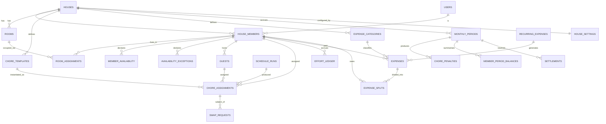

# 04 — Database Design

**Product:** HouseOS
**Version:** 2.0
**Date:** 2026-08-27
**Engine:** PostgreSQL 15+ (Supabase)

Sections 4.8 to 4.11, and the enums, indexes, triggers, policies and views that
serve them, are new in version 2.0: governance, rules, absence, and food. The
existing schema is extended rather than reshaped — every version-1.0 table keeps
its name, its columns and its meaning, and `house_id` remains the tenancy column
everywhere. The interface says Home; the schema says house (see
[01-BRD.md](01-BRD.md) section 0.1 and D-39).

---

## 1. Conventions

These hold for every table without exception.

| Convention | Rule |
|------------|------|
| Primary key | `uuid` named `id`, defaulting to `gen_random_uuid()` |
| Tenancy | Every house-scoped table carries `house_id uuid not null references houses(id)` — even when it is reachable through a parent. It is the column every RLS policy keys on. |
| Money | `bigint`, in paise. `amount_paise`, never `amount`. Rupees exist only in the UI. |
| Points | `integer`. No fractional effort. |
| Timestamps | `timestamptz`, always UTC. `created_at` and `updated_at` on every table, `updated_at` maintained by trigger. |
| Dates | `date` for calendar-day facts (an expense date, a chore date). Interpreted in the house's timezone. |
| Enums | Real Postgres enum types. No free-text status columns. |
| Deletion | Soft, via `deleted_at` or a status enum, wherever history has financial or effort consequence. |
| Naming | `snake_case`, plural table names, singular column names, `_id` suffix on every foreign key. |

---

## 2. Entity relationship overview



### 2.1 Version 2.0 additions

```mermaid
erDiagram
    HOUSES ||--|| GOVERNANCE_POLICY : configured_by
    HOUSES ||--o{ INVITATIONS : issues
    HOUSES ||--o{ JOIN_REQUESTS : receives
    HOUSE_MEMBERS ||--o{ JOIN_REQUESTS : became

    HOUSES ||--o{ DECISIONS : governs
    HOUSE_MEMBERS ||--o{ DECISIONS : proposed
    DECISIONS ||--o{ DECISION_PARTICIPANTS : requires
    DECISIONS ||--o{ DECISION_RESPONSES : collects
    HOUSE_MEMBERS ||--o{ DECISION_RESPONSES : gave

    HOUSES ||--o{ HOME_RULES : declares
    HOME_RULES ||--o{ HOME_RULE_VERSIONS : versioned_as
    DECISIONS ||--o| HOME_RULE_VERSIONS : activated

    HOUSE_MEMBERS ||--o{ ABSENCE_REQUESTS : declares
    DECISIONS ||--o| ABSENCE_REQUESTS : decides
    CHORE_ASSIGNMENTS ||--o{ CHORE_CONFIRMATIONS : confirmed_by
    HOUSE_MEMBERS ||--o{ CHORE_CONFIRMATIONS : gave

    MONTHLY_PERIODS ||--o{ BALANCE_ADJUSTMENTS : corrected_by
    DECISIONS ||--o| BALANCE_ADJUSTMENTS : authorised

    HOUSES ||--o{ FOODS : library
    HOUSES ||--o{ MEALS : ate
    FOODS ||--o{ MEALS : instance_of
    MEALS ||--o{ MEAL_ITEMS : contains
    MEALS ||--o{ MEAL_PARTICIPANTS : eaten_by
    HOUSE_MEMBERS ||--o{ MEAL_PARTICIPANTS : ate
    FOODS ||--o{ FOOD_PREFERENCES : rated
    HOUSE_MEMBERS ||--o{ FOOD_PREFERENCES : rates
    EXPENSES ||--o| MEALS : optionally_linked

    CHORE_ASSIGNMENTS ||--o{ CHORE_ASSIGNMENT_SHARES : shared_between
    HOUSE_MEMBERS ||--o{ CHORE_ASSIGNMENT_SHARES : shares
    HOUSE_MEMBERS ||--o{ MEMBER_EXPECTED_CONTRIBUTIONS : expected_of
    DECISIONS ||--o| MEMBER_EXPECTED_CONTRIBUTIONS : set_by
    HOUSES ||--o{ RESERVES : holds
    RESERVES ||--o{ RESERVE_MOVEMENTS : moved_by
    DECISIONS ||--o| RESERVE_MOVEMENTS : authorised
    EXPENSES ||--o| RESERVE_MOVEMENTS : paid_by_draw
    HOUSES ||--o{ MEAL_PLANS : intends
    FOODS ||--o{ MEAL_PLANS : planned_as
    MEAL_PLANS ||--o| MEALS : confirmed_as
```



---

## 3. Enum types

```sql
create type member_role       as enum ('admin', 'co_admin', 'member');
create type member_status     as enum ('requested', 'active', 'inactive');
create type residency_type    as enum ('full_time', 'weekday_only', 'weekend_only');

create type chore_category    as enum ('room_cleaning', 'cooking', 'kitchen_cleaning',
                                       'bathroom_cleaning', 'common_cleaning', 'mopping', 'other');
create type chore_slot        as enum ('morning', 'evening', 'any');
create type chore_scope       as enum ('house', 'room');
create type chore_frequency   as enum ('daily', 'weekly', 'times_per_week');
create type assignment_status as enum ('assigned', 'open', 'done_pending',
                                       'confirmed', 'rejected', 'missed', 'cancelled');
create type assignment_source as enum ('engine', 'llm', 'admin', 'marketplace', 'swap');
create type swap_status       as enum ('pending', 'accepted', 'declined', 'expired');

create type split_basis       as enum ('equal', 'room_rent', 'custom');
create type expense_status    as enum ('pending_approval', 'approved', 'rejected', 'void');
create type period_status     as enum ('open', 'closing', 'closed', 'reopened');
create type settlement_status as enum ('pending', 'marked_paid', 'confirmed');

create type exception_type    as enum ('away', 'home_all_day', 'custom_hours');
create type notify_channel    as enum ('push', 'in_app');
create type llm_purpose       as enum ('schedule', 'digest', 'nl_parse',
                                       'rule_parse', 'food_ideas', 'food_normalise');
create type llm_credential_status as enum ('unverified', 'active', 'failing', 'disabled');

-- ── version 2.0 ──────────────────────────────────────────────────────────────

create type home_type         as enum ('shared', 'family');

create type decision_type     as enum ('close_settlement', 'reopen_settlement',
                                       'remove_member', 'change_rule',
                                       'change_governance', 'change_home_mode',
                                       'balance_adjustment', 'absence_request',
                                       'join_request', 'expense_approval',
                                       'chore_confirmation',
                                       'set_expected_contribution',
                                       'create_reserve', 'reserve_draw',
                                       'change_confirmation_policy');
create type decision_level    as enum ('normal', 'important', 'critical');
create type decision_status   as enum ('waiting', 'approved', 'rejected',
                                       'lapsed', 'cancelled', 'applied');
create type response_capacity as enum ('approver', 'acknowledger');
create type response_kind     as enum ('approve', 'reject', 'acknowledge');

create type rule_status       as enum ('draft', 'proposed', 'active',
                                       'disabled', 'superseded');
create type rule_parse_source as enum ('manual', 'ai');

create type absence_status    as enum ('requested', 'approved', 'rejected',
                                       'lapsed', 'cancelled');

create type meal_source       as enum ('home_cooked', 'bought', 'ordered', 'other');
create type meal_type         as enum ('breakfast', 'lunch', 'dinner', 'snack', 'other');
create type food_rating       as enum ('like', 'okay', 'dislike');

create type confirmation_policy as enum ('size_aware', 'single', 'off');
```

### 3.1 Migrating the two changed enums

`member_role` gains a value and `member_status` renames one. Postgres allows
neither as an in-place edit of an enum in use, so both are migrations rather than
edits:

```sql
-- member_role: additive, safe
alter type member_role add value if not exists 'co_admin' after 'admin';

-- member_status: 'pending' becomes 'requested'.
-- Renaming an enum label is supported from PG 10 and preserves every row.
alter type member_status rename value 'pending' to 'requested';
```

Every policy, function and check constraint naming `'pending'` must be restated
in the same migration. The rename is silent to `select`, which is exactly why
the migration has to go looking:
`grep -rn "'pending'" supabase/migrations lib/ app/`.

---

## 4. Schema

### 4.1 Identity, house and rooms

```sql
-- Deployment configuration for the scheduled jobs, and the only table in the
-- schema that belongs to no Home.
--
-- `pg_cron` has to reach the Edge Functions, which means it needs the project
-- URL and the service-role key. The obvious place for those is a database
-- setting applied with `alter database ... set`, but that requires superuser,
-- which the `postgres` role on hosted Supabase does not have: the statement
-- fails and the caller raises "unrecognized configuration parameter" at run
-- time. So the values live in a table instead.
--
-- RLS is enabled with **no policies at all**, which denies every ordinary
-- caller; only security-definer functions and the service role see inside. Its
-- two rows are inserted per environment and are never committed — see
-- 13-SETUP-RUNBOOK §7.
create table app_config (
  key        text primary key,      -- 'supabase_url', 'service_key'
  value      text not null,
  updated_at timestamptz not null default now()
);

-- Mirrors auth.users. Supabase owns authentication; this holds the profile.
create table users (
  id            uuid primary key references auth.users(id) on delete cascade,
  email         text not null unique,
  display_name  text not null,
  phone         text,
  upi_vpa       text,                       -- used only to build UPI deep links
  avatar_url    text,
  created_at    timestamptz not null default now(),
  updated_at    timestamptz not null default now()
);

create table houses (
  id            uuid primary key default gen_random_uuid(),
  name          text not null,
  home_type     home_type not null default 'shared',   -- was household_type text
  address       text,
  -- Location: context for food suggestions and nothing else (HM-03, SEC-18).
  country_code  text,                                  -- ISO 3166-1 alpha-2
  state         text,
  city          text,
  area          text,                                  -- approximate, optional
  timezone      text not null default 'Asia/Kolkata',
  currency      text not null default 'INR',
  invite_code   text not null unique,                  -- retained; the link carries it
  created_by    uuid not null references users(id),
  created_at    timestamptz not null default now(),
  updated_at    timestamptz not null default now()
);

create table house_settings (
  house_id                  uuid primary key references houses(id) on delete cascade,
  penalty_rate_paise        bigint  not null default 500,   -- money owed per deficit point
  penalty_enabled           boolean not null default true,
  money_mode                text    not null default 'split',  -- 'split' | 'pot'
  effort_mode               text    not null default 'points',
  expense_approval_threshold_paise bigint not null default 100000,  -- ₹1,000
  auto_confirm_hours        integer not null default 48,
  schedule_generation_dow   integer not null default 0,     -- 0 = Sunday
  schedule_generation_hour  integer not null default 20,
  carry_cap_percent         integer not null default 50,    -- max target adjustment from carry
  -- version 2.0
  -- written only by an applied change_confirmation_policy decision (D-60)
  confirmation_policy       confirmation_policy not null default 'size_aware',
  food_monthly_budget_paise bigint,                         -- drives costPressure
  llm_scheduling_enabled    boolean not null default true,
  game_layer_enabled        boolean not null default false,  -- opt-in gamification per Home
  updated_at                timestamptz not null default now()
);

-- One invite link per Home, rotatable. Possession grants nothing (SEC-15).
create table invitations (
  id           uuid primary key default gen_random_uuid(),
  house_id     uuid not null references houses(id) on delete cascade,
  token        text not null unique,          -- the opaque half of the link
  created_by   uuid not null references house_members(id),
  expires_at   timestamptz,
  revoked_at   timestamptz,
  created_at   timestamptz not null default now()
);

-- A person asks; the Home answers. There is no admin-creates-member path (HM-06).
create table join_requests (
  id            uuid primary key default gen_random_uuid(),
  house_id      uuid not null references houses(id) on delete cascade,
  user_id       uuid not null references users(id) on delete cascade,
  invitation_id uuid references invitations(id),
  message       text,
  status        text not null default 'requested'
                  check (status in ('requested', 'accepted', 'declined', 'withdrawn')),
  decided_by    uuid references house_members(id),
  decided_at    timestamptz,
  decline_reason text,
  member_id     uuid references house_members(id),   -- set on acceptance
  created_at    timestamptz not null default now()
);

-- At most one live request per person per Home. Declined and withdrawn rows
-- accumulate freely, because "they asked three times" is a fact worth keeping.
create unique index uq_join_request_live
  on join_requests (house_id, user_id)
  where status = 'requested';

create table rooms (
  id              uuid primary key default gen_random_uuid(),
  house_id        uuid not null references houses(id) on delete cascade,
  name            text not null,
  capacity        integer not null check (capacity > 0),
  monthly_rent_paise bigint not null default 0,
  deleted_at      timestamptz,
  created_at      timestamptz not null default now(),
  updated_at      timestamptz not null default now(),
  unique (house_id, name)
);

create table house_members (
  id             uuid primary key default gen_random_uuid(),
  house_id       uuid not null references houses(id) on delete cascade,
  user_id        uuid references users(id) on delete cascade,   -- null for a dependent
  member_kind    text not null default 'adult'
                   check (member_kind in ('adult', 'dependent')),
  display_name   text,                        -- carried here for a dependent
  guardian_member_id uuid references house_members(id),
  shares_cost    boolean not null default true,
  does_chores    boolean not null default true,
  -- A Requested person has no role. Role is null until acceptance (HM-07).
  role           member_role,
  status         member_status   not null default 'requested',
  residency      residency_type  not null default 'full_time',
  can_cook       boolean not null default false,
  joined_date    date not null default current_date,
  left_date      date,                        -- null while active
  -- Removal, when money is still outstanding (HM-13, HM-14)
  removal_decision_id uuid,                   -- fk added after decisions exists
  pending_settlement  boolean not null default false,
  created_at     timestamptz not null default now(),
  updated_at     timestamptz not null default now(),
  unique (house_id, user_id),
  constraint requested_has_no_role
    check ((status = 'requested') = (role is null)),
  constraint dependent_has_name
    check (member_kind <> 'dependent' or display_name is not null),
  constraint adult_has_user
    check (member_kind <> 'adult' or user_id is not null)
);

-- Dated, so a past month's rent split uses that month's occupancy.
create table room_assignments (
  id          uuid primary key default gen_random_uuid(),
  house_id    uuid not null references houses(id) on delete cascade,
  room_id     uuid not null references rooms(id) on delete cascade,
  member_id   uuid not null references house_members(id) on delete cascade,
  from_date   date not null,
  to_date     date,                            -- null = current
  created_at  timestamptz not null default now(),
  check (to_date is null or to_date >= from_date)
);
```

### 4.2 Availability and guests

```sql
-- Seven rows per member: the typical week. Times are averages, not exact.
create table member_availability (
  id           uuid primary key default gen_random_uuid(),
  house_id     uuid not null references houses(id) on delete cascade,
  member_id    uuid not null references house_members(id) on delete cascade,
  day_of_week  integer not null check (day_of_week between 0 and 6),  -- 0 = Sunday
  is_home      boolean not null default true,
  leaves_at    time,        -- null when home all day
  returns_at   time,        -- null when home all day
  updated_at   timestamptz not null default now(),
  unique (member_id, day_of_week),
  check (is_home = false or leaves_at is null or returns_at is null or returns_at > leaves_at)
);

create table availability_exceptions (
  id           uuid primary key default gen_random_uuid(),
  house_id     uuid not null references houses(id) on delete cascade,
  member_id    uuid not null references house_members(id) on delete cascade,
  exc_date     date not null,
  exc_type     exception_type not null,
  leaves_at    time,
  returns_at   time,
  reason       text,
  created_at   timestamptz not null default now(),
  unique (member_id, exc_date)
);

create table guests (
  id                uuid primary key default gen_random_uuid(),
  house_id          uuid not null references houses(id) on delete cascade,
  host_member_id    uuid not null references house_members(id) on delete cascade,
  name              text not null,
  from_date         date not null,
  to_date           date not null,
  counts_for_expense boolean not null default true,
  is_assignable     boolean not null default true,
  created_at        timestamptz not null default now(),
  check (to_date >= from_date)
);

-- An Absence is a declared non-presence, optionally asking that the chores it
-- affects be excused (AV-04). Approved: no penalty, no carry-forward (AV-05).
-- Not requested at all: an ordinary missed chore (AV-06).
create table absence_requests (
  id             uuid primary key default gen_random_uuid(),
  house_id       uuid not null references houses(id) on delete cascade,
  member_id      uuid not null references house_members(id) on delete cascade,
  from_date      date not null,
  to_date        date not null,
  reason         text,
  excuse_chores  boolean not null default true,   -- false = "I'm away, keep my work"
  status         absence_status not null default 'requested',
  decision_id    uuid,                            -- fk added after decisions exists
  affected_points integer not null default 0,     -- snapshot at request time
  affected_assignments jsonb,                     -- snapshot: what would move
  decided_at     timestamptz,
  created_at     timestamptz not null default now(),
  updated_at     timestamptz not null default now(),
  check (to_date >= from_date)
);
```

An approved absence writes the matching `availability_exceptions` rows as its
effect, so everything downstream — window derivation, HC-4, target computation —
keeps reading one table and knows nothing about approvals. The request is the
governance object; the exception is the fact.

### 4.3 Chores and scheduling

```sql
create table chore_templates (
  id              uuid primary key default gen_random_uuid(),
  house_id        uuid not null references houses(id) on delete cascade,
  name            text not null,
  category        chore_category not null,
  effort_points   integer not null check (effort_points > 0),
  duration_min    integer not null check (duration_min > 0),
  slot            chore_slot not null default 'any',
  scope           chore_scope not null default 'house',
  room_id         uuid references rooms(id) on delete cascade,   -- required when scope='room'
  frequency       chore_frequency not null,
  times_per_week  integer,                                       -- required when frequency='times_per_week'
  requires_cooking_skill boolean not null default false,
  is_heavy        boolean not null default false,                -- drives the no-repeat-next-week rule
  active          boolean not null default true,
  created_at      timestamptz not null default now(),
  updated_at      timestamptz not null default now(),
  check (scope <> 'room' or room_id is not null),
  check (frequency <> 'times_per_week' or times_per_week between 1 and 7)
);

create table schedule_runs (
  id             uuid primary key default gen_random_uuid(),
  house_id       uuid not null references houses(id) on delete cascade,
  week_start     date not null,                    -- always a Monday
  generated_at   timestamptz not null default now(),
  generator      assignment_source not null,       -- 'engine' or 'llm'
  llm_accepted   boolean,
  llm_rationale  text,
  total_points   integer not null default 0,
  unassigned_count integer not null default 0,
  created_at     timestamptz not null default now(),
  unique (house_id, week_start)
);

create table chore_assignments (
  id                 uuid primary key default gen_random_uuid(),
  house_id           uuid not null references houses(id) on delete cascade,
  schedule_run_id    uuid references schedule_runs(id) on delete set null,
  template_id        uuid not null references chore_templates(id),
  assignee_member_id uuid references house_members(id),   -- null only while status='open'
  guest_id           uuid references guests(id),          -- set when a guest performs it
  chore_date         date not null,
  slot               chore_slot not null,
  window_start       timestamptz not null,
  window_end         timestamptz not null,
  deadline           timestamptz not null,
  effort_points      integer not null,                    -- snapshot; template may change later
  status             assignment_status not null default 'assigned',
  source             assignment_source not null default 'engine',
  done_at            timestamptz,
  photo_url          text,
  confirmed_by       uuid references house_members(id),
  confirmed_at       timestamptz,
  auto_confirmed     boolean not null default false,
  rejected_by        uuid references house_members(id),
  rejected_reason    text,
  retry_count        integer not null default 0,
  -- The quorum, snapshotted when the chore is marked done (DR-13, CE-03).
  -- Membership changing mid-window must not move the requirement.
  confirmations_required   integer not null default 1,
  confirmations_received   integer not null default 0,
  requires_lead_confirmer  boolean not null default false,  -- an Admin or Co-Admin must be one of them
  created_at         timestamptz not null default now(),
  updated_at         timestamptz not null default now(),
  -- nobody confirms their own work
  constraint no_self_confirm check (confirmed_by is null or confirmed_by <> assignee_member_id),
  constraint no_self_reject  check (rejected_by  is null or rejected_by  <> assignee_member_id),
  constraint open_has_no_assignee check (status <> 'open' or assignee_member_id is null),
  constraint window_sane check (window_end > window_start)
);

create table swap_requests (
  id             uuid primary key default gen_random_uuid(),
  house_id       uuid not null references houses(id) on delete cascade,
  assignment_id  uuid not null references chore_assignments(id) on delete cascade,
  from_member_id uuid not null references house_members(id),
  to_member_id   uuid not null references house_members(id),
  status         swap_status not null default 'pending',
  message        text,
  responded_at   timestamptz,
  created_at     timestamptz not null default now(),
  check (from_member_id <> to_member_id)
);

-- One row per confirmation. A Home needing two signatures has two rows.
create table chore_confirmations (
  id             uuid primary key default gen_random_uuid(),
  house_id       uuid not null references houses(id) on delete cascade,
  assignment_id  uuid not null references chore_assignments(id) on delete cascade,
  member_id      uuid not null references house_members(id),
  is_lead        boolean not null default false,   -- this member is an Admin or Co-Admin
  created_at     timestamptz not null default now(),
  unique (assignment_id, member_id)
);
```

`chore_assignments.confirmed_by` and `confirmed_at` survive and mean "the
confirmation that completed the quorum". `chore_confirmations` is the full list.
Auto-confirmation still leaves `confirmed_by` null and sets
`auto_confirmed = true` (D-11), and writes no `chore_confirmations` row — nobody
confirmed it, the clock did, and the record should say so.

The self-confirmation ban is restated on this table, because the old check
constraint only knows about the one completing confirmer:

```sql
alter table chore_confirmations
  add constraint no_self_confirm_row check (
    member_id <> (select assignee_member_id
                    from chore_assignments where id = assignment_id)
  );
```

A check constraint cannot contain a subquery, so this is enforced as a `before
insert` trigger with the same name and the same message. The constraint is
written above the way it reads because that is what it means; the implementation
is a trigger in migration `054_chore_quorum.sql`, which raises
`SELF_CONFIRM` naming `no_self_confirm_row` as its constraint.

### 4.4 Effort accounting

```sql
-- One row per member per week. Written when a week closes.
create table effort_ledger (
  id             uuid primary key default gen_random_uuid(),
  house_id       uuid not null references houses(id) on delete cascade,
  member_id      uuid not null references house_members(id) on delete cascade,
  week_start     date not null,
  base_target    integer not null,     -- before carry adjustment
  carry_in       integer not null default 0,
  effective_target integer not null,   -- base_target - carry_in, capped
  earned_points  integer not null default 0,
  carry_out      integer not null,     -- earned_points - effective_target
  present_days   integer not null default 7,
  assigned_count integer not null default 0,
  confirmed_count integer not null default 0,
  missed_count   integer not null default 0,
  closed_at      timestamptz not null default now(),
  unique (house_id, member_id, week_start)
);

-- Written at month close, from the month's effort_ledger rows.
create table chore_penalties (
  id              uuid primary key default gen_random_uuid(),
  house_id        uuid not null references houses(id) on delete cascade,
  period_id       uuid not null references monthly_periods(id) on delete cascade,
  member_id       uuid not null references house_members(id),
  deficit_points  integer not null default 0,   -- positive number when in deficit
  surplus_points  integer not null default 0,
  rate_paise      bigint not null,
  amount_owed_paise    bigint not null default 0,
  amount_credited_paise bigint not null default 0,
  created_at      timestamptz not null default now(),
  unique (period_id, member_id)
);
```

### 4.5 Expenses

```sql
create table expense_categories (
  id                   uuid primary key default gen_random_uuid(),
  house_id             uuid not null references houses(id) on delete cascade,
  name                 text not null,
  icon                 text,
  monthly_budget_paise bigint,
  active               boolean not null default true,
  created_at           timestamptz not null default now(),
  unique (house_id, name)
);

create table recurring_expenses (
  id             uuid primary key default gen_random_uuid(),
  house_id       uuid not null references houses(id) on delete cascade,
  name           text not null,
  amount_paise   bigint not null check (amount_paise > 0),
  category_id    uuid not null references expense_categories(id),
  paid_by_member_id uuid references house_members(id),   -- null = admin assigns at post time
  split_basis    split_basis not null default 'equal',
  day_of_month   integer not null check (day_of_month between 1 and 28),
  auto_approve   boolean not null default true,
  active         boolean not null default true,
  next_run_date  date not null,
  created_at     timestamptz not null default now(),
  updated_at     timestamptz not null default now()
);

create table monthly_periods (
  id             uuid primary key default gen_random_uuid(),
  house_id       uuid not null references houses(id) on delete cascade,
  period         text not null,                    -- 'YYYY-MM'
  status         period_status not null default 'open',
  total_expense_paise bigint not null default 0,
  total_penalty_paise bigint not null default 0,
  closed_by      uuid references house_members(id),
  closed_at      timestamptz,
  locked_at      timestamptz,                      -- set when every settlement is confirmed
  reopen_count   integer not null default 0,
  created_at     timestamptz not null default now(),
  updated_at     timestamptz not null default now(),
  unique (house_id, period)
);

create table expenses (
  id                uuid primary key default gen_random_uuid(),
  house_id          uuid not null references houses(id) on delete cascade,
  period_id         uuid not null references monthly_periods(id),
  paid_by_member_id uuid not null references house_members(id),
  category_id       uuid not null references expense_categories(id),
   amount_paise      bigint not null check (amount_paise > 0),
  original_currency text,                             -- ISO 4217; null means house default
  original_amount_paise bigint,                       -- amount in original currency before conversion
  description       text,
  expense_date      date not null,
  split_basis       split_basis not null default 'equal',
  status            expense_status not null default 'approved',
  approved_by       uuid references house_members(id),
  approved_at       timestamptz,
  receipt_url       text,
  recurring_id      uuid references recurring_expenses(id),
  -- late-expense handling
  is_adjustment     boolean not null default false,
  adjustment_for_period text,                      -- 'YYYY-MM' of the closed month it belongs to
  -- Optional, in both directions, and never required (FD-07, DR-14)
  meal_id           uuid,                          -- fk added after meals exists; on delete set null
  created_by        uuid not null references house_members(id),
  created_at        timestamptz not null default now(),
  updated_at        timestamptz not null default now(),
  constraint no_self_approve check (approved_by is null or approved_by <> paid_by_member_id),
  constraint adjustment_has_origin check (is_adjustment = false or adjustment_for_period is not null)
);

create table expense_splits (
  id            uuid primary key default gen_random_uuid(),
  house_id      uuid not null references houses(id) on delete cascade,
  expense_id    uuid not null references expenses(id) on delete cascade,
  member_id     uuid not null references house_members(id),
  share_paise   bigint not null check (share_paise >= 0),
  -- a guest's share is carried on the host member's row and recorded here for transparency
  guest_share_paise bigint not null default 0,
  basis_note    text,
  created_at    timestamptz not null default now(),
  unique (expense_id, member_id)
);
```

### 4.6 Settlement

```sql
create table member_period_balances (
  id                 uuid primary key default gen_random_uuid(),
  house_id           uuid not null references houses(id) on delete cascade,
  period_id          uuid not null references monthly_periods(id) on delete cascade,
  member_id          uuid not null references house_members(id),
  total_paid_paise   bigint not null default 0,
  fair_share_paise   bigint not null default 0,
  expense_net_paise  bigint not null default 0,   -- paid - fair share
  penalty_owed_paise bigint not null default 0,
  penalty_credit_paise bigint not null default 0,
  final_net_paise    bigint not null default 0,   -- positive: house owes the member
  computed_at        timestamptz not null default now(),
  unique (period_id, member_id)
);

create table settlements (
  id               uuid primary key default gen_random_uuid(),
  house_id         uuid not null references houses(id) on delete cascade,
  period_id        uuid not null references monthly_periods(id) on delete cascade,
  from_member_id   uuid not null references house_members(id),
  to_member_id     uuid not null references house_members(id),
  amount_paise     bigint not null check (amount_paise > 0),
  status           settlement_status not null default 'pending',
  upi_link         text,
  marked_paid_at   timestamptz,
  confirmed_at     timestamptz,
  note             text,
  created_at       timestamptz not null default now(),
  updated_at       timestamptz not null default now(),
  check (from_member_id <> to_member_id)
);

-- A governed correction to a balance. Historical expenses are never edited
-- (EX-12). This is how "cancel what he owes me" is recorded honestly.
create table balance_adjustments (
  id              uuid primary key default gen_random_uuid(),
  house_id        uuid not null references houses(id) on delete cascade,
  period_id       uuid not null references monthly_periods(id) on delete cascade,
  from_member_id  uuid not null references house_members(id),
  to_member_id    uuid not null references house_members(id),
  amount_paise    bigint not null check (amount_paise > 0),
  reason          text not null check (length(reason) >= 10),
  decision_id     uuid not null,                 -- fk added after decisions exists
  created_by      uuid not null references house_members(id),
  applied_at      timestamptz,
  created_at      timestamptz not null default now(),
  check (from_member_id <> to_member_id)
);
```

An adjustment is a directed transfer between two members' net positions, applied
at close alongside expenses and penalties. It sums to zero on its own — one
member's net falls by exactly what the other's rises — so the settlement
invariant is untouched. `decision_id` is `not null`: there is no path to an
adjustment that did not go through governance.

### 4.7 Governance

```sql
create table governance_policy (
  house_id                  uuid primary key references houses(id) on delete cascade,
  critical_requires_coadmin boolean not null default true,
  critical_member_rule      text not null default 'proportion'
                              check (critical_member_rule in ('count', 'proportion')),
  critical_member_value     integer not null default 50,
  governance_requires_all   boolean not null default true,
  absence_approver_roles    member_role[] not null default '{admin,co_admin}',
  join_approver_roles       member_role[] not null default '{admin,co_admin}',
  expense_approvals_required integer not null default 1,
  decision_deadline_days    integer not null default 7,
  absence_deadline_hours    integer not null default 48,
  updated_at                timestamptz not null default now()
);

-- One record behind every shared decision in the product.
create table decisions (
  id                 uuid primary key default gen_random_uuid(),
  house_id           uuid not null references houses(id) on delete cascade,
  type               decision_type not null,
  level              decision_level not null,
  requested_by       uuid not null references house_members(id),
  subject_type       text,                       -- 'member' | 'period' | 'rule' | 'expense' | …
  subject_id         uuid,
  payload            jsonb not null default '{}'::jsonb,   -- what would change
  reason             text,
  required_approvals integer not null default 0,
  required_acks      integer not null default 0,
  deadline           timestamptz,
  status             decision_status not null default 'waiting',
  result             jsonb,                      -- what actually changed
  supersedes_id      uuid references decisions(id),  -- a re-proposal after a lapse
  resolved_at        timestamptz,
  applied_at         timestamptz,
  apply_error        text,                       -- approved but could not be applied
  created_at         timestamptz not null default now(),
  updated_at         timestamptz not null default now(),
  constraint critical_needs_reason
    check (level <> 'critical' or (reason is not null and length(reason) >= 10)),
  constraint applied_implies_approved
    check (applied_at is null or status = 'applied')
);

create table decision_participants (
  id           uuid primary key default gen_random_uuid(),
  house_id     uuid not null references houses(id) on delete cascade,
  decision_id  uuid not null references decisions(id) on delete cascade,
  member_id    uuid not null references house_members(id),
  capacity     response_capacity not null,
  is_mandatory boolean not null default false,
  created_at   timestamptz not null default now(),
  unique (decision_id, member_id)
);

create table decision_responses (
  id           uuid primary key default gen_random_uuid(),
  house_id     uuid not null references houses(id) on delete cascade,
  decision_id  uuid not null references decisions(id) on delete cascade,
  member_id    uuid not null references house_members(id),
  capacity     response_capacity not null,
  response     response_kind not null,
  reason       text,
  responded_at timestamptz not null default now(),
  unique (decision_id, member_id),
  constraint reject_needs_reason
    check (response <> 'reject' or (reason is not null and length(reason) >= 10)),
  constraint acknowledger_cannot_reject
    check (capacity <> 'acknowledger' or response = 'acknowledge')
);
```

Two rules the schema enforces on its own, and one it cannot:

- **A rejection needs a reason**, on every decision kind. A batch of identical
  reasons is not a reason, which is why Approve All has no Reject All.
- **An acknowledger cannot reject.** The whole distinction between the two
  capacities is that one gates and can refuse while the other only gates.
- **The subject of a decision is not a participant in it** needs the subject and
  the participant compared across two tables, so it is a `before insert` trigger
  on `decision_participants` rather than a check constraint.

The deferred foreign keys named earlier close here, once `decisions` exists:

```sql
alter table house_members     add constraint fk_removal_decision
  foreign key (removal_decision_id) references decisions(id);
alter table absence_requests  add constraint fk_absence_decision
  foreign key (decision_id)         references decisions(id);
alter table balance_adjustments add constraint fk_adjustment_decision
  foreign key (decision_id)         references decisions(id);
```

### 4.8 Rules

```sql
create table home_rules (
  id                 uuid primary key default gen_random_uuid(),
  house_id           uuid not null references houses(id) on delete cascade,
  title              text not null,
  status             rule_status not null default 'draft',
  current_version_id uuid,                       -- fk added after versions exists
  sort_order         integer not null default 0,
  created_by         uuid not null references house_members(id),
  created_at         timestamptz not null default now(),
  updated_at         timestamptz not null default now(),
  unique (house_id, title)
);

-- Rules are never overwritten. Editing appends a version (RL-06, DR-11).
create table home_rule_versions (
  id              uuid primary key default gen_random_uuid(),
  house_id        uuid not null references houses(id) on delete cascade,
  rule_id         uuid not null references home_rules(id) on delete cascade,
  version_no      integer not null,
  -- exactly what the Admin typed, kept forever (RL-09)
  original_text   text not null,
  parsed_by       rule_parse_source not null default 'manual',
  title           text not null,
  condition       jsonb not null default '{}'::jsonb,
  action          jsonb not null default '{}'::jsonb,
  applies_to      jsonb not null default '{"kind":"all"}'::jsonb,
  weight_points   integer,
  penalty_paise   bigint,
  starts_on       date,
  ends_on         date,
  change_reason   text,
  decision_id     uuid references decisions(id),
  activated_at    timestamptz,
  superseded_at   timestamptz,
  created_by      uuid not null references house_members(id),
  created_at      timestamptz not null default now(),
  unique (rule_id, version_no),
  -- SEC-16: a rule cannot go live without a decision behind it
  constraint activation_requires_decision
    check (activated_at is null or decision_id is not null),
  constraint sane_dates
    check (ends_on is null or starts_on is null or ends_on >= starts_on)
);

alter table home_rules add constraint fk_current_version
  foreign key (current_version_id) references home_rule_versions(id);
```

`condition`, `action` and `applies_to` are `jsonb` rather than columns because
the structured kinds are a small, growing vocabulary and version 2.0 executes
only two of them automatically. A rule the Home wrote down and agreed to is
valuable whether or not the engine can act on it, and modelling every possible
condition as columns would be modelling a language nobody has finished designing.
The two executed kinds are validated on write against a schema in
`lib/domain/rules/kinds.ts`; anything else is stored and displayed.

### 4.9 Food

```sql
-- The Home's food library: one row per distinct food, deduplicated (FD-09).
create table foods (
  id                  uuid primary key default gen_random_uuid(),
  house_id            uuid not null references houses(id) on delete cascade,
  name                text not null,
  normalised_name     text not null,             -- lowercase, unpunctuated, collapsed
  default_source      meal_source,
  default_items       text[] not null default '{}',
  region_tag          text,                      -- e.g. 'IN-TN'; null = unregioned
  meal_types          meal_type[] not null default '{}',
  typical_cost_paise  bigint,                    -- rolling median of recorded meals
  times_eaten         integer not null default 0,
  last_eaten_on       date,
  home_preference     numeric(4,3),              -- −1.000 … +1.000, derived
  active              boolean not null default true,
  merged_into_id      uuid references foods(id), -- set when two entries are merged
  created_by          uuid not null references house_members(id),
  created_at          timestamptz not null default now(),
  updated_at          timestamptz not null default now(),
  unique (house_id, normalised_name)
);

-- One thing that was eaten, on a date, by named people (FD-01).
create table meals (
  id                  uuid primary key default gen_random_uuid(),
  house_id            uuid not null references houses(id) on delete cascade,
  food_id             uuid references foods(id),  -- null if not saved to the library
  name                text not null,              -- snapshotted; the library may be renamed
  meal_date           date not null,
  meal_type           meal_type not null default 'other',
  source              meal_source not null default 'home_cooked',
  base_cost_paise     bigint not null default 0 check (base_cost_paise     >= 0),
  prep_cost_paise     bigint not null default 0 check (prep_cost_paise     >= 0),
  delivery_cost_paise bigint not null default 0 check (delivery_cost_paise >= 0),
  other_cost_paise    bigint not null default 0 check (other_cost_paise    >= 0),
  total_cost_paise    bigint not null default 0,  -- stored, not derived (DR-12)
  expense_id          uuid references expenses(id) on delete set null,  -- optional (FD-07)
  photo_url           text,
  recipe_instructions text,                           -- optional plain-text recipe steps
  note                text,
  created_by          uuid not null references house_members(id),
  created_at          timestamptz not null default now(),
  updated_at          timestamptz not null default now()
);

alter table expenses add constraint fk_expense_meal
  foreign key (meal_id) references meals(id) on delete set null;

create table meal_items (
  id            uuid primary key default gen_random_uuid(),
  house_id      uuid not null references houses(id) on delete cascade,
  meal_id       uuid not null references meals(id) on delete cascade,
  name          text not null,
  quantity      text,                             -- free text; not a unit system
  cost_paise    bigint,                           -- optional per-item attribution
  sort_order    integer not null default 0
);

create table meal_participants (
  id            uuid primary key default gen_random_uuid(),
  house_id      uuid not null references houses(id) on delete cascade,
  meal_id       uuid not null references meals(id) on delete cascade,
  member_id     uuid references house_members(id),  -- null for a guest or an unnamed eater
  guest_id      uuid references guests(id),
  label         text,                               -- for someone who is neither
  share_paise   bigint not null default 0,
  unique (meal_id, member_id),
  constraint one_identity check (
    (member_id is not null)::int + (guest_id is not null)::int
      + (label is not null)::int = 1
  )
);

-- A standing opinion about a food, not about one meal instance (FD-11, FD-12).
create table food_preferences (
  id            uuid primary key default gen_random_uuid(),
  house_id      uuid not null references houses(id) on delete cascade,
  food_id       uuid references foods(id) on delete cascade,
  item_name     text,                             -- an opinion about an ingredient
  member_id     uuid not null references house_members(id) on delete cascade,
  rating        food_rating not null,
  created_at    timestamptz not null default now(),
  updated_at    timestamptz not null default now(),
  constraint food_or_item check (
    (food_id is not null)::int + (item_name is not null)::int = 1
  )
);

create unique index uq_pref_food on food_preferences (member_id, food_id)
  where food_id is not null;
create unique index uq_pref_item on food_preferences (member_id, lower(item_name))
  where item_name is not null;
```

Three modelling notes worth stating, because each looks like an omission:

- **`meals.name` is snapshotted** even when `food_id` is set. Renaming a library
  entry in December must not rewrite what a meal in August was called.
- **A preference is per food or per item, never per meal instance.** "I like
  paruppu sadham" is a standing fact; the meal on 26 August is evidence for it.
  The item form is what lets one dislike ("bitter gourd") suppress every meal
  containing it without anybody tagging meals by hand.
- **`meal_participants.member_id` is nullable** so that a guest, or a friend who
  is nobody in this system, can still be a head in the per-person cost. A head
  that is nobody is allowed here, unlike in an expense split, because a meal
  creates no debt.

### 4.10 Notifications, AI and audit

```sql
create table push_subscriptions (
  id          uuid primary key default gen_random_uuid(),
  house_id    uuid not null references houses(id) on delete cascade,
  member_id   uuid not null references house_members(id) on delete cascade,
  endpoint    text not null unique,
  p256dh      text not null,
  auth        text not null,
  user_agent  text,
  -- Where the row was registered. Platform/provider metadata selects the
  -- dispatcher adapter: web uses Web Push/VAPID, native clients use their
  -- platform push provider. Native tokens are not browser endpoints.
  platform     text not null default 'web' check (platform in ('web', 'android', 'ios')),
  failed_at    timestamptz,
  last_seen_at timestamptz not null default now(),
  created_at   timestamptz not null default now()
);

The current table is a web/PWA schema: `endpoint`, `p256dh` and `auth` are
Web Push fields. Product phase 2 must introduce a backwards-compatible device
registration migration (for example, nullable web fields plus provider/token
metadata) before native clients are connected. Do not insert an Android/iOS
provider token into `endpoint` or fabricate browser encryption keys.

-- Seven categories. Six are preferences; `settlement_updates` is stored as a
-- column for symmetry but is always written `true` — a member who has muted the
-- app cannot then claim they were never told they owed money.
create table notification_prefs (
  member_id             uuid primary key references house_members(id) on delete cascade,
  house_id              uuid not null references houses(id) on delete cascade,
  chore_reminders       boolean not null default true,
  confirmation_requests boolean not null default true,
  chore_outcomes        boolean not null default true,
  house_activity        boolean not null default true,
  expense_activity      boolean not null default true,
  weekly_digest         boolean not null default true,
  settlement_updates    boolean not null default true,
  quiet_hours_start     time default '23:00',
  quiet_hours_end       time default '07:00',
  updated_at            timestamptz not null default now(),
  -- Both null means quiet hours are off. One of each is a half-open range with
  -- no end, which the dispatcher cannot act on.
  check ((quiet_hours_start is null) = (quiet_hours_end is null))
);

create table notifications (
  id             uuid primary key default gen_random_uuid(),
  house_id       uuid not null references houses(id) on delete cascade,
  member_id      uuid not null references house_members(id) on delete cascade,
  type           text not null,
  title          text not null,
  body           text not null,
  deep_link      text,
  channel        notify_channel not null default 'in_app',
  -- Push collapse key (11-NOTIFICATIONS-SPEC §4). A second reminder for the
  -- same chore replaces the first on the device rather than stacking beneath it.
  tag            text,
  priority       integer not null default 5,
  -- Everything the action handler needs, so the service worker does not have to
  -- parse the tag to find an assignment id.
  payload        jsonb not null default '{}'::jsonb,
  -- When it becomes eligible. `now()` for anything immediate; a computed
  -- instant for the availability-aware reminders.
  scheduled_for  timestamptz not null default now(),
  sent_at        timestamptz,
  push_sent_at   timestamptz,
  read_at        timestamptz,
  -- Set on a row folded into a coalesced digest instead of pushed.
  coalesced_into uuid references notifications(id) on delete set null,
  created_at     timestamptz not null default now()
);

-- The copy catalogue. Every string a notification renders lives here rather
-- than in application code, so 11-NOTIFICATIONS-SPEC and the database cannot
-- drift. RLS is on with a read-everyone policy: it holds no house data, and
-- both the preferences screen and the feed render from it.
create table notification_types (
  type               text primary key,   -- 'N-01' … 'N-57'
  category           text not null,       -- the notification_prefs column it obeys
  priority           integer not null,
  quiet_hours_exempt boolean not null default false,
  label              text not null,
  title_template     text not null,
  body_template      text not null,
  deep_link_template text not null
);

-- Where one type's body depends on the reader's side of the record — N-22 is
-- the settlement line, which differs for the payer and the receiver.
create table notification_variants (
  type          text not null references notification_types(type) on delete cascade,
  variant       text not null,
  body_template text not null,
  primary key (type, variant)
);

create table house_llm_credentials (
  house_id         uuid primary key references houses(id) on delete cascade,
  provider         text not null,
  model            text not null,
  base_url         text,
  key_ciphertext   bytea not null,             -- AES-256-GCM; never plaintext
  key_iv           bytea not null,
  key_tag          bytea not null,
  key_last4        text not null,
  key_version      integer not null default 1,
  status           llm_credential_status not null default 'unverified',
  last_verified_at timestamptz,
  last_error       text,
  created_by       uuid not null references users(id),
  created_at       timestamptz not null default now(),
  updated_at       timestamptz not null default now()
);
-- RLS on, and no select policy for any role: the ciphertext is readable only
-- by the service role. Members read the house_llm_config view instead, which
-- stops at key_last4. Writes go through set_house_llm_credential, which is
-- security definer and admin-only.

create table llm_runs (
  id                uuid primary key default gen_random_uuid(),
  house_id          uuid not null references houses(id) on delete cascade,
  purpose           llm_purpose not null,
  provider          text not null,
  model             text not null,
  input_payload     jsonb not null,
  output_payload    jsonb,
  accepted          boolean not null default false,
  validation_errors jsonb,
  prompt_tokens     integer,
  completion_tokens integer,
  latency_ms        integer,
  error             text,
  created_at        timestamptz not null default now()
);

create table activity_log (
  id              uuid primary key default gen_random_uuid(),
  house_id        uuid not null references houses(id) on delete cascade,
  actor_member_id uuid references house_members(id),
  entity_type     text not null,
  entity_id       uuid,
  action          text not null,
  before_state    jsonb,
  after_state     jsonb,
  created_at      timestamptz not null default now()
);

-- ──────────────────────────────────────────────────────────────────────
-- v2.0 additions: shopping, gamification, complaints, announcements
-- ──────────────────────────────────────────────────────────────────────

create table shopping_items (
  id              uuid primary key default gen_random_uuid(),
  house_id        uuid not null references houses(id) on delete cascade,
  name            text not null,
  quantity         text,
  unit             text,
  estimated_price_paise bigint,
  meal_id          uuid references meals(id) on delete set null,  -- linked meal if from meal plan
  checked_off      boolean not null default false,
  checked_off_by   uuid references house_members(id),
  checked_off_at   timestamptz,
  created_by       uuid not null references house_members(id),
  created_at       timestamptz not null default now(),
  updated_at       timestamptz not null default now()
);

create table house_announcements (
  id              uuid primary key default gen_random_uuid(),
  house_id        uuid not null references houses(id) on delete cascade,
  author_member_id uuid not null references house_members(id),
  title           text not null,
  body            text not null,
  severity        text not null default 'info',  -- 'info' | 'important' | 'urgent'
  expires_at      timestamptz not null,
  created_at      timestamptz not null default now()
);

-- chore_comments and chore_projects are unscheduled schema stubs. No BRD
-- requirement, no business rule and no roadmap phase carries them, and they are
-- not part of the version-2 release. The reasoning is in
-- 16-COMPETITIVE-POSITIONING.md section 5.2: a chore is a unit of measured
-- effort with a point weight, and subdividing it makes the weight meaningless
-- and the confirmation quorum ambiguous. Do not build against them without a
-- requirement first.
create table chore_comments (
  id              uuid primary key default gen_random_uuid(),
  house_id        uuid not null references houses(id) on delete cascade,
  assignment_id   uuid not null references chore_assignments(id) on delete cascade,
  author_member_id uuid not null references house_members(id),
  body            text not null,
  created_at      timestamptz not null default now()
);

create table chore_projects (
  id              uuid primary key default gen_random_uuid(),
  house_id        uuid not null references houses(id) on delete cascade,
  name            text not null,
  description     text,
  status          text not null default 'active',  -- 'active' | 'completed' | 'archived'
  created_by      uuid not null references house_members(id),
  created_at      timestamptz not null default now(),
  updated_at      timestamptz not null default now()
);

-- ──────────────────────────────────────────────────────────────────────
-- v2.0 additions from the competitive analysis: shared chore assignment,
-- expected contribution, the reserve, and planned meals.
-- See 16-COMPETITIVE-POSITIONING.md sections 2 and 3.
-- ──────────────────────────────────────────────────────────────────────

-- CE-11. A chore instance shared between two or more assignees. The rows exist
-- only for shared instances; a single-assignee instance keeps using
-- chore_assignments.assignee_member_id and has no rows here.
create table chore_assignment_shares (
  id              uuid primary key default gen_random_uuid(),
  house_id        uuid not null references houses(id) on delete cascade,
  assignment_id   uuid not null references chore_assignments(id) on delete cascade,
  member_id       uuid not null references house_members(id),
  share_points    integer not null check (share_points > 0),
  share_order     integer not null,          -- fixes the division order, so it is deterministic
  created_at      timestamptz not null default now(),
  unique (assignment_id, member_id),
  unique (assignment_id, share_order)
);
-- Σ share_points = chore_assignments.effort_points is enforced by a deferred
-- constraint trigger, the same way expense_splits are (section 6).

-- EX-13. Display-only. It charges nobody and enters no split.
create table member_expected_contributions (
  id              uuid primary key default gen_random_uuid(),
  house_id        uuid not null references houses(id) on delete cascade,
  member_id       uuid not null references house_members(id) on delete cascade,
  amount_paise    bigint not null check (amount_paise >= 0),
  effective_from  date not null,
  effective_to    date,                       -- null while current
  decision_id     uuid not null references decisions(id),   -- BR-281: never set directly
  created_at      timestamptz not null default now(),
  check (effective_to is null or effective_to > effective_from)
);

-- EX-14. A named pot with a running balance.
create table reserves (
  id              uuid primary key default gen_random_uuid(),
  house_id        uuid not null references houses(id) on delete cascade,
  name            text not null,
  balance_paise   bigint not null default 0 check (balance_paise >= 0),
  decision_id     uuid not null references decisions(id),   -- BR-287: creation is governed
  active          boolean not null default true,
  created_at      timestamptz not null default now(),
  unique (house_id, name)
);

create table reserve_movements (
  id              uuid primary key default gen_random_uuid(),
  house_id        uuid not null references houses(id) on delete cascade,
  reserve_id      uuid not null references reserves(id) on delete cascade,
  kind            text not null check (kind in ('contribution','draw')),
  amount_paise    bigint not null check (amount_paise > 0),
  member_id       uuid references house_members(id),   -- the contributor, on a contribution
  expense_id      uuid references expenses(id),        -- the cost paid, on a draw
  decision_id     uuid references decisions(id),
  period_id       uuid references monthly_periods(id),
  note            text,
  created_at      timestamptz not null default now(),
  -- BR-284: a contribution names its member. BR-285/BR-287: a draw names the
  -- expense it pays and the decision that authorised it.
  check (kind <> 'contribution' or member_id is not null),
  check (kind <> 'draw' or (expense_id is not null and decision_id is not null))
);

-- FD-20. An intention, not a record. It carries no cost, no participants and no
-- preference signal (BR-217); confirming it as eaten creates a row in meals.
create table meal_plans (
  id              uuid primary key default gen_random_uuid(),
  house_id        uuid not null references houses(id) on delete cascade,
  food_id         uuid references foods(id) on delete set null,
  name            text not null,                -- snapshotted, so a library edit does not rewrite the plan
  planned_date    date not null,
  created_by      uuid not null references house_members(id),
  confirmed_meal_id uuid references meals(id) on delete set null,   -- set when confirmed as eaten
  created_at      timestamptz not null default now()
);

create table member_badges (
  id              uuid primary key default gen_random_uuid(),
  house_id        uuid not null references houses(id) on delete cascade,
  member_id       uuid not null references house_members(id),
  badge_type      text not null,  -- 'chore_10', 'chore_50', 'chore_100', etc.
  awarded_at      timestamptz not null default now(),
  unique(house_id, member_id, badge_type)
);

create table member_streaks (
  id              uuid primary key default gen_random_uuid(),
  house_id        uuid not null references houses(id) on delete cascade,
  member_id       uuid not null references house_members(id),
  current_streak  integer not null default 0,
  longest_streak  integer not null default 0,
  last_active_date date,
  points          integer not null default 0,
  unique(house_id, member_id)
);
```

---

## 5. Indexes

```sql
-- Tenancy filters: every list query starts with house_id
create index idx_members_house        on house_members(house_id, status);
create index idx_rooms_house          on rooms(house_id) where deleted_at is null;
create index idx_room_assign_current  on room_assignments(house_id, member_id, from_date desc);
create index idx_room_assign_room     on room_assignments(room_id, from_date, to_date);

-- Availability lookups during generation
create index idx_availability_member  on member_availability(member_id, day_of_week);
create index idx_exceptions_range     on availability_exceptions(house_id, exc_date);
create index idx_guests_range         on guests(house_id, from_date, to_date);

-- The two hottest queries: my chores today, and the house week view
create index idx_assign_member_date   on chore_assignments(assignee_member_id, chore_date, status);
create index idx_assign_house_date    on chore_assignments(house_id, chore_date);
create index idx_assign_pending       on chore_assignments(house_id, status)
                                      where status in ('done_pending', 'assigned', 'open');
create index idx_assign_run           on chore_assignments(schedule_run_id);

create index idx_share_assignment     on chore_assignment_shares(assignment_id);
create index idx_share_member         on chore_assignment_shares(member_id);
-- CH-12: the last-completed figure is a per-template max over confirmed rows
create index idx_assign_last_done      on chore_assignments(template_id, done_at desc)
                                       where status = 'confirmed';

-- Effort
create index idx_ledger_member_week   on effort_ledger(member_id, week_start desc);
create index idx_ledger_house_week    on effort_ledger(house_id, week_start desc);

-- Expenses
create index idx_expense_period       on expenses(period_id, status);
create index idx_expense_house_date   on expenses(house_id, expense_date desc);
create index idx_expense_payer        on expenses(paid_by_member_id, expense_date desc);
create index idx_expense_category     on expenses(category_id, expense_date desc);
create index idx_splits_member        on expense_splits(member_id);
create index idx_splits_expense       on expense_splits(expense_id);

-- Expected contribution and the reserve
create index idx_expected_current     on member_expected_contributions(house_id, member_id)
                                     where effective_to is null;
create index idx_reserve_moves        on reserve_movements(reserve_id, created_at desc);
create index idx_reserve_period       on reserve_movements(house_id, period_id);

-- Planned meals
create index idx_meal_plans_date      on meal_plans(house_id, planned_date)
                                     where confirmed_meal_id is null;

-- Settlement
create index idx_settlement_period    on settlements(period_id, status);
create index idx_settlement_member    on settlements(from_member_id, status);

-- Notifications and audit
create index idx_notif_unread         on notifications(member_id, read_at) where read_at is null;
create index idx_activity_entity      on activity_log(house_id, entity_type, entity_id, created_at desc);

-- ── version 2.0 ──────────────────────────────────────────────────────────────

-- Membership and joining
create index idx_members_role         on house_members(house_id, role) where status = 'active';
create index idx_members_pending_settle on house_members(house_id)
                                      where status = 'inactive' and pending_settlement;
create index idx_join_requests_open   on join_requests(house_id, created_at desc)
                                      where status = 'requested';
create index idx_invitations_live     on invitations(house_id) where revoked_at is null;

-- The Approvals surface: "everything waiting on me", the hottest new query
create index idx_participants_member  on decision_participants(member_id, decision_id);
create index idx_decisions_waiting    on decisions(house_id, status, deadline)
                                      where status = 'waiting';
create index idx_decisions_subject    on decisions(house_id, subject_type, subject_id);
create index idx_responses_decision   on decision_responses(decision_id);

-- Rules
create index idx_rules_active         on home_rules(house_id, sort_order) where status = 'active';
create index idx_rule_versions        on home_rule_versions(rule_id, version_no desc);

-- Absence and confirmation
create index idx_absence_member       on absence_requests(member_id, from_date desc);
create index idx_absence_open         on absence_requests(house_id, from_date)
                                      where status = 'requested';
create index idx_confirmations_assign on chore_confirmations(assignment_id);

-- Food: the library lookup, the recommender's candidate scan, and the history
create index idx_foods_lookup         on foods(house_id, normalised_name) where active;
create index idx_foods_recent         on foods(house_id, last_eaten_on desc nulls last)
                                      where active;
create index idx_meals_house_date     on meals(house_id, meal_date desc);
create index idx_meals_food           on meals(food_id, meal_date desc);
create index idx_meal_participants    on meal_participants(meal_id);
create index idx_prefs_member         on food_preferences(member_id);
create index idx_prefs_food           on food_preferences(food_id);

-- Adjustments
create index idx_adjustments_period   on balance_adjustments(period_id);
```

The one worth explaining is `idx_participants_member`. "What is waiting on me"
is rendered on the Approvals surface, on the Today screen and in the navigation
badge — three places, on every page load, for every member. It joins
`decision_participants` to `decisions` and anti-joins `decision_responses`, and
without an index leading on `member_id` it is a sequential scan of every
decision the Home has ever made.

---

## 6. Triggers and integrity rules

```sql
-- 6.1  updated_at maintenance, applied to every table that has the column
create or replace function touch_updated_at() returns trigger as $$
begin
  new.updated_at = now();
  return new;
end;
$$ language plpgsql;

-- 6.2  Splits must sum exactly to their expense amount
create or replace function assert_split_sum() returns trigger as $$
declare
  v_expense_id uuid := coalesce(new.expense_id, old.expense_id);
  v_total  bigint;
  v_amount bigint;
begin
  select coalesce(sum(share_paise + guest_share_paise), 0)
    into v_total from expense_splits where expense_id = v_expense_id;
  select amount_paise into v_amount from expenses where id = v_expense_id;

  if v_total <> v_amount then
    raise exception 'split total % does not equal expense amount % for expense %',
      v_total, v_amount, v_expense_id;
  end if;
  return null;
end;
$$ language plpgsql;

create constraint trigger trg_split_sum
  after insert or update or delete on expense_splits
  deferrable initially deferred
  for each row execute function assert_split_sum();

-- 6.3  A closed period is immutable
create or replace function assert_period_open() returns trigger as $$
declare v_status period_status;
begin
  select status into v_status from monthly_periods
   where id = coalesce(new.period_id, old.period_id);
  if v_status = 'closed' then
    raise exception 'period is closed and cannot be modified';
  end if;
  return new;
end;
$$ language plpgsql;

create trigger trg_expense_period_open
  before insert or update or delete on expenses
  for each row execute function assert_period_open();

-- 6.4  Points post to the ledger exactly once, on entry to 'confirmed'
create or replace function post_effort_points() returns trigger as $$
begin
  if new.status = 'confirmed' and old.status <> 'confirmed' then
    insert into effort_ledger (house_id, member_id, week_start, base_target,
                               effective_target, earned_points, carry_out)
    values (new.house_id, new.assignee_member_id,
            date_trunc('week', new.chore_date)::date, 0, 0, new.effort_points, 0)
    on conflict (house_id, member_id, week_start)
      do update set earned_points   = effort_ledger.earned_points + new.effort_points,
                    confirmed_count = effort_ledger.confirmed_count + 1;
  end if;
  return new;
end;
$$ language plpgsql;

create trigger trg_post_points
  after update on chore_assignments
  for each row execute function post_effort_points();

-- 6.5  A decision's effect is applied only once, only when approved, and only
--      when every mandatory participant has answered (SEC-12).
create or replace function apply_decision(p_decision_id uuid)
returns jsonb as $$
declare
  d decisions%rowtype;
  v_missing integer;
  v_result jsonb;
begin
  select * into d from decisions where id = p_decision_id for update;

  if d.status <> 'approved' then
    raise exception 'decision % is % and cannot be applied', p_decision_id, d.status
      using errcode = 'check_violation';
  end if;

  select count(*) into v_missing
    from decision_participants p
   where p.decision_id = d.id
     and p.is_mandatory
     and not exists (select 1 from decision_responses r
                      where r.decision_id = d.id and r.member_id = p.member_id);

  if v_missing > 0 then
    raise exception 'decision % is missing % mandatory response(s)', p_decision_id, v_missing
      using errcode = 'check_violation';
  end if;

  v_result := apply_decision_effect(d);        -- one dispatch per decision_type

  update decisions
     set status = 'applied', applied_at = now(), result = v_result
   where id = d.id;

  return v_result;
end;
$$ language plpgsql security definer;

revoke execute on function apply_decision(uuid) from public, anon, authenticated;

-- 6.6  A confirmation moves the quorum, and completing it confirms the chore.
create or replace function post_chore_confirmation() returns trigger as $$
declare a chore_assignments%rowtype;
begin
  select * into a from chore_assignments where id = new.assignment_id for update;

  if a.status <> 'done_pending' then
    raise exception 'chore % is % and is not awaiting confirmation', a.id, a.status;
  end if;

  update chore_assignments
     set confirmations_received = confirmations_received + 1
   where id = a.id;

  if (a.confirmations_received + 1) >= a.confirmations_required
     and (not a.requires_lead_confirmer
          or new.is_lead
          or exists (select 1 from chore_confirmations
                      where assignment_id = a.id and is_lead)) then
    update chore_assignments
       set status = 'confirmed', confirmed_by = new.member_id, confirmed_at = now()
     where id = a.id;
  end if;
  return new;
end;
$$ language plpgsql;

create trigger trg_chore_confirmation
  after insert on chore_confirmations
  for each row execute function post_chore_confirmation();

-- 6.7  A meal's participant shares sum to its total.
create or replace function assert_meal_share_sum() returns trigger as $$
declare
  v_meal_id uuid := coalesce(new.meal_id, old.meal_id);
  v_total bigint; v_sum bigint;
begin
  select total_cost_paise into v_total from meals where id = v_meal_id;
  select coalesce(sum(share_paise), 0) into v_sum
    from meal_participants where meal_id = v_meal_id;

  -- A meal with no participants recorded has no per-person cost, and that is
  -- allowed. A meal with participants must account for every paisa.
  if v_sum <> 0 and v_sum <> v_total then
    raise exception 'meal % shares total % but the meal cost %', v_meal_id, v_sum, v_total;
  end if;
  return null;
end;
$$ language plpgsql;

create constraint trigger trg_meal_share_sum
  after insert or update or delete on meal_participants
  deferrable initially deferred
  for each row execute function assert_meal_share_sum();

-- 6.8  A shared chore's share points sum exactly to the instance's points (CE-11).
--      The same shape as 6.2 and 6.7, for the same reason: a division that
--      loses a point makes the effort standing wrong and the fairness argument
--      unwinnable.
create or replace function assert_share_sum() returns trigger as $$
declare
  v_assignment_id uuid := coalesce(new.assignment_id, old.assignment_id);
  v_sum integer; v_points integer;
begin
  select coalesce(sum(share_points), 0) into v_sum
    from chore_assignment_shares where assignment_id = v_assignment_id;
  select effort_points into v_points
    from chore_assignments where id = v_assignment_id;

  -- No rows means an unshared instance, which is the normal case.
  if v_sum <> 0 and v_sum <> v_points then
    raise exception 'shares total % but assignment % is worth %',
      v_sum, v_assignment_id, v_points;
  end if;
  return null;
end;
$$ language plpgsql;

create constraint trigger trg_share_sum
  after insert or update or delete on chore_assignment_shares
  deferrable initially deferred
  for each row execute function assert_share_sum();

-- 6.9  A shared assignee can never confirm the instance they share (CE-11, SEC-04).
--      The existing check covers the named assignee; this covers the others.
create or replace function assert_not_shared_assignee() returns trigger as $$
begin
  if exists (select 1 from chore_assignment_shares s
              where s.assignment_id = new.assignment_id
                and s.member_id = new.member_id) then
    raise exception 'member % is a shared assignee of assignment % and cannot confirm it',
      new.member_id, new.assignment_id;
  end if;
  return new;
end;
$$ language plpgsql;

create trigger trg_share_not_confirmer
  before insert on chore_confirmations
  for each row execute function assert_not_shared_assignee();

-- 6.10 The reserve balance is maintained from its movements and can never go
--      negative (EX-14, BR-283). A draw larger than the balance is refused here
--      as well as at proposal time, because a decision approved days ago can be
--      applied after another draw has already emptied the pot.
create or replace function apply_reserve_movement() returns trigger as $$
declare v_balance bigint;
begin
  select balance_paise into v_balance from reserves where id = new.reserve_id for update;

  if new.kind = 'draw' and new.amount_paise > v_balance then
    raise exception 'reserve % holds % but the draw is for %',
      new.reserve_id, v_balance, new.amount_paise;
  end if;

  update reserves
     set balance_paise = balance_paise
         + case when new.kind = 'contribution' then new.amount_paise
                else -new.amount_paise end
   where id = new.reserve_id;
  return new;
end;
$$ language plpgsql;

create trigger trg_reserve_movement
  after insert on reserve_movements
  for each row execute function apply_reserve_movement();
```

Twelve integrity guarantees follow from the constraints and triggers above, and
each has a corresponding test:

1. **A split set can never disagree with its expense.** Enforced by a deferred constraint trigger, so a multi-row insert inside one transaction is checked once, at commit.
2. **A closed period can never be written to.** Reopening is an explicit, governed status change, which is itself logged.
3. **Nobody can confirm or approve their own work or spending.** Check constraints on the assignment and on the expense, and a trigger on every confirmation row.
4. **Points cannot be posted twice.** The transition guard `old.status <> 'confirmed'` makes the trigger idempotent under repeated updates.
5. **A decision's effect is applied once, only when approved, and only with every mandatory response in place.** `apply_decision` is `security definer` with `execute` revoked from `public`, `anon` and `authenticated` — the lesson of D-20 applied to the new surface.
6. **A Requested member has no role.** A check constraint ties `status = 'requested'` and `role is null` together in both directions, so neither can be set without the other.
7. **A rule cannot go live without a decision.** `activation_requires_decision`.
8. **An acknowledger cannot reject**, and **a rejection carries a reason of at least ten characters.** Both check constraints on `decision_responses`.
9. **A meal's participant shares sum to its total**, or there are no participants at all. A deferred constraint trigger, the same shape as the expense-split guarantee.
10. **A shared chore's shares sum to the instance's points**, or the instance is unshared. The third instance of the same deferred-constraint pattern, for the same reason: an arithmetic that loses a point makes the fairness argument unwinnable.
11. **No shared assignee can confirm the instance they share.** The existing check constraint covers the named assignee; a trigger on `chore_confirmations` covers the others.
12. **The reserve can never go negative, and its balance always equals its movements.** The draw is re-checked at apply time under `for update`, because a decision approved days ago can be applied after another draw has emptied the pot.

---

## 7. Row Level Security

Every table has RLS enabled. Two helper functions keep the policies short.

```sql
alter table houses            enable row level security;
alter table house_members     enable row level security;
alter table rooms             enable row level security;
alter table chore_templates   enable row level security;
alter table chore_assignments enable row level security;
alter table expenses          enable row level security;
alter table expense_splits    enable row level security;
alter table settlements       enable row level security;
-- ... and so on for every table in section 4

create or replace function is_house_member(p_house_id uuid) returns boolean as $$
  select exists (
    select 1 from house_members
     where house_id = p_house_id
       and user_id  = auth.uid()
       and status   = 'active'
  );
$$ language sql security definer stable;

create or replace function is_house_admin(p_house_id uuid) returns boolean as $$
  select exists (
    select 1 from house_members
     where house_id = p_house_id
       and user_id  = auth.uid()
       and status   = 'active'
       and role     = 'admin'
  );
$$ language sql security definer stable;

-- Version 2.0: the operational tier. Admin and Co-Admin together.
create or replace function is_house_lead(p_house_id uuid) returns boolean as $$
  select exists (
    select 1 from house_members
     where house_id = p_house_id
       and user_id  = auth.uid()
       and status   = 'active'
       and role in ('admin', 'co_admin')
  );
$$ language sql security definer stable;
```

`is_house_member` is unchanged and load-bearing for a reason worth restating:
it requires `status = 'active'`, so a `requested` or `inactive` person is a
non-member for every read of every house-scoped table, with no separate code
path anywhere. That one predicate is the whole implementation of SEC-14 and of
HM-07's "no permissions of any kind".

**The read policy, applied to every house-scoped table.** Members see everything in their house — that transparency is the product.

```sql
create policy read_own_house on expenses
  for select using (is_house_member(house_id));
```

**The member write policy**, for tables members may write to (expenses, assignments they own, availability, guests):

```sql
create policy member_insert_expense on expenses
  for insert with check (
    is_house_member(house_id)
    and created_by in (select id from house_members
                        where house_id = expenses.house_id and user_id = auth.uid())
  );
```

**The admin write policy**, for configuration tables:

```sql
create policy admin_write_templates on chore_templates
  for all using (is_house_admin(house_id)) with check (is_house_admin(house_id));
```

**A narrower policy for chore actions.** A member may mark done only their own assignment, and may confirm only somebody else's:

```sql
create policy member_updates_own_assignment on chore_assignments
  for update using (
    is_house_member(house_id)
    and (
      assignee_member_id in (select id from house_members
                              where house_id = chore_assignments.house_id and user_id = auth.uid())
      or status = 'done_pending'      -- anyone may confirm or reject a pending one
      or status = 'open'              -- anyone may claim from the pool
    )
  );
```

**The lead write policy**, for the tables Admin and Co-Admin share:

```sql
create policy lead_write_templates on chore_templates
  for all using (is_house_lead(house_id)) with check (is_house_lead(house_id));
```

Applied to `chore_templates`, `rooms`, `expense_categories`, `foods`,
`invitations` and the accept path on `join_requests`. `house_settings` and
`governance_policy` stay admin-only.

**Governance policies.** Three tables, three different shapes.

```sql
-- Everyone in the Home sees every decision. Transparency is the product.
create policy read_decisions on decisions
  for select using (is_house_member(house_id));

-- Anyone may propose; the domain decides what level it lands at.
create policy member_proposes on decisions
  for insert with check (
    is_house_member(house_id)
    and requested_by in (select id from house_members
                          where house_id = decisions.house_id
                            and user_id = auth.uid())
  );

-- Only a listed participant may respond, and only for themselves.
create policy participant_responds on decision_responses
  for insert with check (
    is_house_member(house_id)
    and member_id in (select id from house_members
                       where house_id = decision_responses.house_id
                         and user_id = auth.uid())
    and exists (select 1 from decision_participants p
                 where p.decision_id = decision_responses.decision_id
                   and p.member_id   = decision_responses.member_id
                   and p.capacity    = decision_responses.capacity)
  );
```

There is **no update or delete policy on `decision_responses` for any role.** A
response is a fact about what somebody said, and it is not revisable. Changing
your mind is a new decision.

There is likewise **no update policy on `decisions` for `authenticated`.** Status
transitions are made by `security definer` functions — `resolve_decision` and
`apply_decision` — with `execute` revoked from `public`, `anon` and
`authenticated`. A member cannot move a decision to `approved` by updating a
column, which is the whole reason the column is not writable.

**Food policies** are the ordinary member ones: read anything in the Home, write
your own meals and your own preferences, and leave the library to the leads
except for creating a new entry, which any member may do because that is what
saving a meal means.

```sql
create policy member_rates_food on food_preferences
  for all using (
    is_house_member(house_id)
    and member_id in (select id from house_members
                       where house_id = food_preferences.house_id
                         and user_id = auth.uid())
  );
```

**Testing obligation.** Every policy above has a test that creates two Homes with
one member each and proves that member A receives zero rows from Home B, for
every table. T-RLS-01 is written as a loop over the table list, so a table added
without a policy fails the suite automatically — which is the mechanism that
keeps SEC-01 true as sixteen new tables arrive.

Three additional obligations specific to version 2.0:

- A `requested` member receives zero rows from **their own** Home, for every
  table, including `decisions` and `foods`.
- A member who is a participant in decision X cannot insert a response to
  decision Y, or a response on behalf of another member.
- No role can `update` or `delete` a `decision_responses` row, and no role can
  `update` `decisions.status`.

Three more, from the competitive analysis additions:

- `member_expected_contributions`, `reserves` and `reserve_movements` are
  readable by every Active member of the Home — there is no per-member privacy on
  a Home's financial position (EX-10, IN-09). Insert and update run only through
  `apply_decision`; `insert`, `update` and `delete` are revoked from
  `authenticated` on all three.
- A `reserve_movements` row of kind `draw` with a null `decision_id` is refused
  by check constraint, so a service-role key cannot bypass the governance path
  (BR-287, SEC-16's pattern).
- `chore_assignment_shares` inherits the assignment's Home. A member may not
  insert, edit or delete a share — shares are written by the generator and by the
  swap and release effects, never by a client.

---

## 8. Views for the read paths

```sql
-- Current room occupancy, the basis for common-area weighting and rent splits
create view v_current_occupancy as
select ra.house_id, ra.room_id, r.name as room_name, r.capacity,
       r.monthly_rent_paise, ra.member_id, u.display_name
  from room_assignments ra
  join rooms r        on r.id = ra.room_id
  join house_members m on m.id = ra.member_id
  join users u         on u.id = m.user_id
 where ra.to_date is null and m.status = 'active';

-- The leaderboard: running effort position per member
create view v_effort_standing as
select el.house_id, el.member_id, u.display_name,
       sum(el.earned_points)      as total_earned,
       sum(el.effective_target)   as total_target,
       sum(el.carry_out)          as running_carry,
       sum(el.confirmed_count)    as chores_done,
       sum(el.missed_count)       as chores_missed
  from effort_ledger el
  join house_members m on m.id = el.member_id
  join users u         on u.id = m.user_id
 group by el.house_id, el.member_id, u.display_name;

-- Everything waiting on the caller, across every decision type. This is the
-- Approvals surface, the Today "pending" block and the navigation badge.
create view v_my_pending_decisions as
select d.house_id, d.id as decision_id, d.type, d.level, d.deadline,
       d.subject_type, d.subject_id, d.payload,
       p.member_id, p.capacity, p.is_mandatory,
       u.display_name as requested_by_name
  from decisions d
  join decision_participants p on p.decision_id = d.id
  join house_members rm on rm.id = d.requested_by
  left join users u      on u.id = rm.user_id
 where d.status = 'waiting'
   and not exists (select 1 from decision_responses r
                    where r.decision_id = d.id and r.member_id = p.member_id);

-- Who owes whom, netted pairwise, visible to everyone (EX-10, EX-11).
create view v_pairwise_balances as
with owed as (
  select s.house_id, s.from_member_id as debtor, s.to_member_id as creditor,
         sum(s.amount_paise) as amount_paise
    from settlements s
   where s.status <> 'confirmed'
   group by s.house_id, s.from_member_id, s.to_member_id
)
select a.house_id, a.debtor, a.creditor,
       a.amount_paise - coalesce(b.amount_paise, 0) as net_paise
  from owed a
  left join owed b
    on b.house_id = a.house_id
   and b.debtor   = a.creditor
   and b.creditor = a.debtor
 where a.amount_paise - coalesce(b.amount_paise, 0) > 0;

-- The library recommender's candidate set, with everything it scores on.
create view v_food_candidates as
select f.house_id, f.id as food_id, f.name, f.normalised_name, f.region_tag,
       f.meal_types, f.typical_cost_paise, f.times_eaten, f.last_eaten_on,
       f.home_preference,
       current_date - f.last_eaten_on as days_since,
       (select count(*) from meals m
         where m.food_id = f.id and m.meal_date > current_date - 30) as eaten_last_30
  from foods f
 where f.active and f.merged_into_id is null;

-- CH-12: when each template was last actually completed, and by whom.
-- Confirmed completions only: a done_pending row is pending, not done, and a
-- rejected one never becomes the last-completed (BR-077).
create view v_template_last_done as
select t.house_id, t.id as template_id, t.name,
       a.done_at        as last_done_at,
       a.assignee_member_id as last_done_by,
       u.display_name   as last_done_by_name
  from chore_templates t
  left join lateral (
       select ca.done_at, ca.assignee_member_id
         from chore_assignments ca
        where ca.template_id = t.id and ca.status = 'confirmed'
        order by ca.done_at desc
        limit 1
  ) a on true
  left join house_members lm on lm.id = a.assignee_member_id
  left join users u          on u.id = lm.user_id;
-- last_done_at is null for a template never confirmed done. The UI renders that
-- as "never completed"; it never substitutes the creation date.

-- EX-14: the reserve's running balance from its movements, so the stored
-- balance_paise can be checked against the history that produced it.
create view v_reserve_position as
select r.house_id, r.id as reserve_id, r.name, r.balance_paise,
       coalesce(sum(case when m.kind = 'contribution' then m.amount_paise end), 0) as contributed_paise,
       coalesce(sum(case when m.kind = 'draw'         then m.amount_paise end), 0) as drawn_paise
  from reserves r
  left join reserve_movements m on m.reserve_id = r.id
 group by r.house_id, r.id, r.name, r.balance_paise;

-- Live period position, before close
create view v_period_position as
select e.house_id, e.period_id, m.id as member_id, u.display_name,
       coalesce(sum(case when e.paid_by_member_id = m.id then e.amount_paise end), 0) as paid_paise,
       coalesce(sum(s.share_paise + s.guest_share_paise), 0)                          as share_paise
  from house_members m
  join users u          on u.id = m.user_id
  left join expense_splits s on s.member_id = m.id
  left join expenses e       on e.id = s.expense_id and e.status = 'approved'
 group by e.house_id, e.period_id, m.id, u.display_name;
```

---

## 9. Seed data for development

A seeded house lets the schedule generator be exercised on day one.

- One house, `Asia/Kolkata`, INR.
- Three rooms: capacity 3, 3 and 2. Rents ₹9,000, ₹9,000 and ₹7,000.
- Eight members: one admin, five full-time, one weekday-only, one weekend-only. Three flagged `can_cook`.
- Availability deliberately varied: two who leave at 07:00 and return at 22:00, three at 09:30 to 19:00, one working from home, one on weekend-only residency.
- Chore templates: cooking dinner (30 points, 60 min, evening, daily), kitchen cleaning (20 / 30 / evening / daily), bathroom cleaning (25 / 30 / any / twice weekly, heavy), common-area mopping (15 / 20 / morning / three times weekly), room cleaning (10 / 15 / any / weekly, room-scoped, one per room), rubbish disposal (5 / 5 / evening / daily).
- Expense categories: groceries, rent, utilities, gas, internet, maid, eating out, household.
- Two months of history so that analytics and trends have something to draw.

Version 2.0 adds, so that governance and food are exercisable on day one:

- **Roles:** one Admin, one Co-Admin, six Members. A Home with no Co-Admin is the
  second fixture, because the participant rules change shape without one.
- **A Requested person**, so that the "zero rows from their own Home" assertion
  has a subject.
- **Governance policy** at the documented defaults, plus one Home configured to
  `governance_requires_all = true` with a member who never responds, so that
  lapse is reachable in a test rather than only in production.
- **Decisions in every state:** one `waiting` close, one `approved` but not yet
  applied, one `rejected` with a reason, one `lapsed`, one `applied`.
- **Rules:** four active rules across two versions each, one disabled, and one
  `draft` that was parsed by AI and never submitted.
- **Food:** a library of twelve foods with region tags, forty meals across two
  months mixing all four sources, participants that are sometimes a subset of the
  Home, item-level preferences including one dislike that suppresses three meals
  for one member, and a Home whose food spend is over budget so `costPressure`
  is non-zero somewhere in the fixtures.
- **Four near-duplicate food names** — `Paruppu Sadham`, `Parupu Sadham`,
  `Paruppu Sadam`, `Parupu Rice` — as the deduplication fixture.
