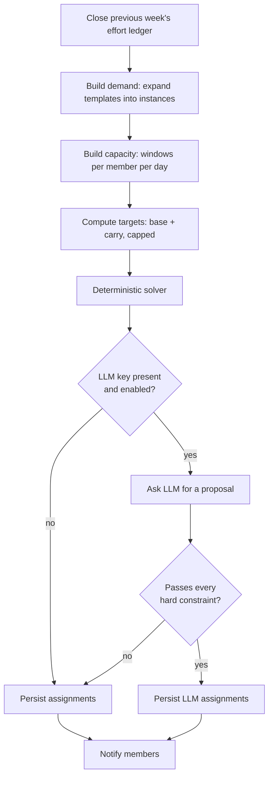

# 06 — Core Algorithms

**Product:** HouseOS
**Version:** 2.0
**Date:** 2026-08-26

This document specifies the logic that the product's fairness claims rest on. Everything here is a pure function: plain data in, plain data out, no database access. That is what makes it testable, and testability is what makes it trustworthy.

Eight algorithms:

1. **Availability windows** — turning presence and optional in/out times into assignable capacity
2. **Weekly schedule generation** — demand, targets, constraints, solver
3. **Confirmation quorum** — how many people must confirm a chore, in this Home *(new in 2.0)*
4. **Decision resolution** — approvals, acknowledgements, mandatory participants, lapse *(new in 2.0)*
5. **Expense splitting** — equal, room-rent and custom bases
6. **Settlement netting** — reducing balances to the fewest payments
7. **Pairwise balance netting** — the who-owes-whom view every member sees *(new in 2.0)*
8. **Food recommendation** — scoring the Home's own library *(new in 2.0)*

---

## 1. Availability windows

### 1.1 The problem

Members leave and return at different times, and those times are averages rather than commitments. A member who leaves at 07:00 cannot be given a morning chore. A member who returns at 22:00 cannot cook dinner. Availability must therefore constrain *which* chores a person receives — but, per decision 2 in the index, it must never reduce *how much* they owe.

**Version 2.0 makes the times optional** (AV-01). The primary fact is presence:
am I home on this weekday or not. A member who supplies no times is treated as
home all day, which is what `leaves_at is null and returns_at is null` already
produced — so the algorithm below is unchanged and only the onboarding
expectation moves. A Home that never enters a single time still gets a working
schedule; the times are a refinement that buys better slot fit, not a
precondition.

### 1.2 Definitions

```
DAY_START = 06:00     (house-configurable)
DAY_END   = 23:00
MIN_BUFFER = 15 min   (a chore may not consume the last minutes of a window)
```

For member `m` on date `d`, with weekday availability `A(m, weekday(d))` and any exception `E(m, d)`:

```
if E exists and E.type = 'away':
    windows = []                                   // no capacity at all
else if E exists and E.type = 'home_all_day':
    windows = [ { kind: FULL,    start: DAY_START, end: DAY_END } ]
else:
    leaves  = E?.leaves_at  ?? A.leaves_at
    returns = E?.returns_at ?? A.returns_at

    if A.is_home = false:
        windows = []
    else if leaves is null and returns is null:     // home all day by default
        windows = [ { kind: FULL, start: DAY_START, end: DAY_END } ]
    else:
        windows = [
          { kind: MORNING, start: DAY_START, end: leaves  },
          { kind: EVENING, start: returns,   end: DAY_END }
        ]
```

Windows shorter than `MIN_BUFFER` are dropped.

### 1.3 Fit test

A chore instance with slot `S` and duration `D` fits member `m` on date `d` when:

```
fits(m, d, S, D) =
    ∃ w ∈ windows(m, d) such that
        slotMatches(w.kind, S) and (w.end − w.start) ≥ D + MIN_BUFFER

slotMatches(FULL,    anything) = true
slotMatches(MORNING, MORNING)  = true
slotMatches(MORNING, ANY)      = true
slotMatches(EVENING, EVENING)  = true
slotMatches(EVENING, ANY)      = true
otherwise                      = false
```

### 1.4 Capacity

Weekly capacity in minutes:

```
capacity(m, week) = Σ over days d in week: Σ over w ∈ windows(m, d): (w.end − w.start)
```

Capacity is **not** used to set targets. It is used for two things only:

- The feasibility check above.
- A tie-break: when two members are equally short of target, the one with more remaining capacity that week receives the chore.

**Worked example.** Ravi leaves 09:30 and returns 19:00 on weekdays; home all day Saturday and Sunday.

| Day | Morning window | Evening window | Total |
|-----|----------------|----------------|-------|
| Mon–Fri | 06:00–09:30 = 210 min | 19:00–23:00 = 240 min | 450 min each |
| Sat–Sun | 06:00–23:00 = 1020 min | — | 1020 min each |
| **Week** | | | **4,290 min** |

Suresh leaves 07:00 and returns 22:00 on weekdays, and is out on Saturday:

| Day | Morning | Evening | Total |
|-----|---------|---------|-------|
| Mon–Fri | 60 min | 60 min | 120 min each |
| Sat | 0 | 0 | 0 |
| Sun | 1020 min | — | 1020 min |
| **Week** | | | **1,620 min** |

Suresh has 38 percent of Ravi's capacity. **His points target is identical.** He simply receives Sunday-weighted work and short evening chores. That is the design working as intended.

---

## 2. Weekly schedule generation

Runs every Sunday at 20:00 in the house timezone, for the week beginning the following Monday.

### 2.1 Overview



### 2.2 Step 1 — Close the previous week

For each active member, write the `effort_ledger` row for the week just ending:

```
earned      = Σ effort_points of assignments confirmed in that week
carry_out   = earned − effective_target
```

`carry_out` is negative for a deficit and positive for a surplus. It becomes next week's `carry_in`.

### 2.3 Step 2 — Build demand

Expand every active chore template into dated instances:

| Frequency | Expansion |
|-----------|-----------|
| `daily` | One instance on each of the seven days |
| `weekly` | One instance, placed on the day with the widest aggregate capacity |
| `times_per_week: n` | `n` instances, spread as evenly as possible across the week |

Each instance carries: `template_id`, `chore_date`, `slot`, `duration_min`, `effort_points`, `scope`, `room_id`, `requires_cooking_skill`, `is_heavy`.

**Room-scoped expansion.** A template with `scope = 'room'` expands once *per room*, and each resulting instance is eligible only to that room's occupants.

**Common-area weighting (CH-08).** Common-area instances are not simply divided by member count. A three-person room collectively owes more of the common work than a two-person room. This is achieved through the target calculation rather than the expansion: since targets are per member and every member's target is equal, a three-person room automatically absorbs three shares against a two-person room's two. No extra mechanism is required — the equal-per-member target already produces occupancy-weighted room load. Recording this explicitly because it looks like a missing feature otherwise.

**Guest instances.** For each assignable guest present on a date, add the guest's proportional share of that day's common workload as instances eligible to that guest, with the host member recorded as accountable.

### 2.4 Step 3 — Compute targets

```
total_points     = Σ effort_points over all instances in the week
present_days(m)  = 7 − (count of 'away' exception days for m in the week)
                   and, for weekday_only / weekend_only residency, only their resident days

weight(m)        = present_days(m) / 7
base_target(m)   = total_points × weight(m) / Σ over all members: weight(m)

carry_in(m)      = carry_out(m) from the previous week
cap              = base_target(m) × house.carry_cap_percent / 100

adjustment(m)    = clamp(−carry_in(m), −cap, +cap)
effective_target(m) = round(base_target(m) + adjustment(m))
```

The sign convention: a **deficit** last week is a negative `carry_in`, so `−carry_in` is positive and the target *rises*. A surplus lowers it. The cap prevents a member who missed one bad week from facing an impossible target, and prevents a member with a large surplus from being assigned nothing at all.

**Worked example.** House workload 840 points, 8 members, all present all week.

| Member | Present days | Base target | Carry in | Adjustment (cap ±52) | Effective target |
|--------|--------------|-------------|----------|----------------------|------------------|
| Ravi | 7 | 105 | +60 (surplus) | −52 | 53 |
| Kumar | 7 | 105 | +25 | −25 | 80 |
| Suresh | 7 | 105 | −85 (deficit) | +52 | 157 |
| Vinoth | 7 | 105 | 0 | 0 | 105 |
| Others (×4) | 7 | 105 | 0 | 0 | 105 |
| | | **840** | | | **815** |

The effective targets do not sum to the total workload — that is expected and correct. The solver assigns *all* 840 points; targets are the objective it minimises deviation from, not a quota it must exactly fill. The 25-point residual is distributed to whoever is furthest below target after the main pass.

### 2.5 Step 4 — Hard constraints

An assignment of instance `i` to person `p` is **valid** only if all of these hold. There are no soft exceptions; a violation invalidates the assignment.

| # | Constraint | Rule |
|---|-----------|------|
| HC-1 | Availability | `fits(p, i.chore_date, i.slot, i.duration_min)` is true |
| HC-2 | Room scope | If `i.scope = 'room'`, `p` occupies `i.room_id` on `i.chore_date` |
| HC-3 | Cooking skill | If `i.requires_cooking_skill`, `p.can_cook` is true |
| HC-4 | Presence | `p` has no `away` exception on `i.chore_date`, and their residency covers that day |
| HC-5 | No double-booking | The instances assigned to `p` on that date, in that window, do not overlap in time |
| HC-6 | Daily ceiling | `p` receives at most 3 instances or 150 minutes on any single day |
| HC-7 | Guest eligibility | A guest instance is assigned to that guest or to their host, and to nobody else |
| HC-8 | Active membership | `p` is an active member on `i.chore_date` |

### 2.6 Step 5 — Soft objectives

Ranked. The solver optimises them in this order.

| # | Objective | Weight |
|---|-----------|--------|
| SO-1 | Minimise Σ over members of `(assigned_points − effective_target)²` | 1.0 |
| SO-2 | Avoid assigning a `is_heavy` template to the same member two consecutive weeks | 0.5 |
| SO-3 | Spread a member's own instances across the week rather than clustering them | 0.3 |
| SO-4 | Prefer variety: avoid giving the same member the same template repeatedly within a week | 0.2 |
| SO-5 | Prefer the member with more remaining capacity when otherwise tied | 0.1 |

### 2.7 Step 6 — The solver

Greedy construction followed by local search. Not optimal, and it does not need to be — it needs to be feasible, fair within a few points, and fast.

```
function solve(instances, members, targets, history):
    // 1. Most-constrained-first ordering
    for each instance i:
        i.eligible = [ p ∈ members : satisfiesHardConstraints(i, p) ]
    sort instances by (count(i.eligible) ascending, effort_points descending)

    assigned = {}
    remaining = { m: targets[m] for m in members }

    // 2. Greedy construction
    for each instance i in sorted order:
        if i.eligible is empty:
            mark i as OPEN; notify admin; continue

        candidates = i.eligible sorted by:
             remaining[p] descending                      // furthest below target first
             then heavyPenalty(p, i, history) ascending   // SO-2
             then clusterPenalty(p, i, assigned) ascending// SO-3
             then varietyPenalty(p, i, assigned) ascending// SO-4
             then capacityLeft(p) descending              // SO-5

        p = candidates[0]
        assigned[i] = p
        remaining[p] -= i.effort_points

    // 3. Local search: pairwise swaps that reduce the objective
    for iteration in 1..200:
        improved = false
        for each pair of instances (i, j) with different assignees:
            if swapIsValid(i, j) and objective(after swap) < objective(now):
                apply swap; improved = true
        if not improved: break

    return assigned
```

**Complexity.** Construction is `O(n · m · log m)` for `n` instances and `m` members. Local search is capped at 200 iterations over `O(n²)` pairs. For the realistic case — 8 members, roughly 50 instances — this completes in well under a second, comfortably inside NFR-03.

### 2.8 Step 7 — The LLM overlay

Only after the deterministic result exists. The fallback is therefore always in hand before any network call.

**Sent to the model:**

```json
{
  "week_start": "2026-08-24",
  "members": [
    { "id": "m1", "name": "Ravi", "target": 53, "carry_in": 60, "can_cook": true,
      "room": "R1", "windows": { "mon": [["06:00","09:30"],["19:00","23:00"]] } }
  ],
  "instances": [
    { "id": "i1", "chore": "Cook dinner", "date": "2026-08-24", "slot": "evening",
      "points": 30, "duration": 60, "requires_cooking": true }
  ],
  "history": [ { "member": "m1", "template": "Bathroom cleaning", "weeks_ago": 1 } ],
  "constraints": [ "HC-1 ... HC-8, stated in full" ]
}
```

Per SEC-06, member identifiers and first names only. No email, phone, UPI identifier or surname.

**Expected response:**

```json
{
  "assignments": [ { "instance_id": "i1", "member_id": "m1" } ],
  "rationale": "Ravi's target is low this week because he carried a 60-point surplus..."
}
```

**Validation — every one of these must pass, or the whole proposal is discarded:**

1. Every instance appears exactly once.
2. No instance is assigned to a member who is not in the input.
3. Every assignment satisfies all eight hard constraints.
4. Per-member deviation from target does not exceed the deterministic solver's maximum deviation by more than 15 percent.

There is no partial acceptance and no repair pass. A model that returns a nearly-valid schedule is a model whose output is thrown away. The reason is stated in the architecture decisions: a schedule that quietly violates availability destroys trust in the entire system, and one such incident is worth more than every schedule the LLM improves.

Both outcomes are recorded in `llm_runs`, with the specific failed constraints when rejected.

### 2.9 Shared assignment and the last-completed figure

**New in 2.0**, from the competitive analysis (16-COMPETITIVE-POSITIONING §2.1).

**Shared assignment (CE-11).** A chore instance may carry more than one
assignee. Its effort points divide between them and must sum exactly to the
template's points, by the same last-share-absorbs-the-remainder rule the split
calculator uses for money:

```
share(i)     = floor(points / n)          for i in 0 .. n-2
share(n-1)   = points − floor(points / n) × (n − 1)
Σ share(i)   = points                      // exact, by construction
```

Worked: a 25-point bathroom chore shared by three members gives 8, 8 and 9.
The order is the assignment order, so the same instance always produces the same
division (NFR-15).

Consequences, all of which follow from the shares being real effort points:

- Every shared assignee is independently accountable. If the instance is missed,
  each of them misses their own share.
- Confirmation excludes **all** shared assignees, not only the one who tapped
  Done (CE-02, SEC-04). In a two-member Home where both are assignees, the
  quorum has nobody left and the instance auto-confirms at the window (section
  3, small-Home case) rather than blocking forever.
- A swap or a release (CE-08) moves one member's share, not the whole instance.
- The target calculator in section 2.4 sees shares, not instances, so a shared
  chore does not distort anybody's weekly target.

**The last-completed figure (CH-12).** For every template, the schedule and the
template list show when it was last actually completed and by whom:

```
last_done(template) = the confirmed instance with the greatest completed_at
                      for that template in this Home
age_days            = today (house timezone) − date(last_done.completed_at)
```

Three rules make this figure trustworthy rather than decorative:

1. Only a **confirmed** completion counts. A completion still inside its
   confirmation window shows as pending, not as done, and a rejected one never
   becomes the last-done. This is the difference between the figure the analysis
   credits to Sweepy and one that records "I clicked Done".
2. `age_days` is computed in the Home's timezone (NFR-10), so a chore never
   reads as a day older or newer than the Home experienced it.
3. A template with no confirmed completion says **"never completed"**. It does
   not fall back to the creation date and it does not render an empty cell.

The figure is derived, not stored: it is a query over `chore_instances`, so it
can never disagree with the completion history it is drawn from.

---

## 3. Confirmation quorum

**New in 2.0.** Version 1.0 asked one peer to confirm a chore at every Home
size. That is too little for an eight-person house, where whoever is nearest taps
approve, and structurally impossible in a two-person one if it demands an Admin.
The quorum scales.

### 3.1 The rule

```
function quorumFor(house, assignment):
    if house.confirmation_policy = 'off':
        return { required: 0, needsLead: false }        // auto-confirm on marking done
    if house.confirmation_policy = 'single':
        return { required: 1, needsLead: false }

    n = count(active adult members, excluding the assignee
              and excluding the assignee's guardian where the assignee is a dependent)

    if n = 0:  return { required: 0, needsLead: false }  // nobody to ask
    if n <= 2: return { required: 1, needsLead: false }  // a 2–3 person Home
    if n <= 5: return { required: 2, needsLead: true  }  // a 4–6 person Home
    else:      return { required: 3, needsLead: true  }  // 7 or more
```

`n` counts the people who *could* confirm, which is the Home's Active adult
members minus the ones the rules forbid. The bands in
[01-BRD.md](01-BRD.md) CE-03 are stated in Home size; this function works in
eligible-confirmer count, and the two agree because the assignee is always one of
the Home's members. A four-person Home has three eligible confirmers and needs a
lead plus one other — two rows in `chore_confirmations`.

`needsLead` means one of the confirmations must come from an Admin or Co-Admin.
It is a property of the set, not of an ordering: the lead may confirm first,
last, or in the middle.

### 3.2 Completion

```
function isConfirmed(assignment, confirmations):
    q = assignment.quorum                       // snapshotted when marked done
    if count(confirmations) < q.required: return false
    if q.needsLead and not any(c.is_lead for c in confirmations): return false
    return true
```

Four properties, each tested:

| Property | Why it matters |
|----------|----------------|
| The assignee is never in `confirmations` | The rule the whole mechanism rests on. Enforced in the database too. |
| The quorum is snapshotted at "done", not evaluated at "confirm" | A member joining mid-window must not raise the bar on work already done, and one leaving must not lower it. |
| One rejection ends it immediately | Otherwise a rejected chore sits collecting confirmations that cannot matter. |
| Auto-confirm applies at every size | A quorum requiring a lead, with no timeout, hands every Admin a veto over everyone's points — the exact failure mode design decision 3 exists to prevent. |

### 3.3 Worked examples

| Home | Active adults | Eligible (n) | Required | Needs lead | In words |
|------|--------------:|-------------:|---------:|:----------:|----------|
| One person | 1 | 0 | 0 | — | Auto-confirmed on marking done |
| Couple | 2 | 1 | 1 | no | The other person |
| Three flatmates | 3 | 2 | 1 | no | Any one of the others |
| Four flatmates | 4 | 3 | 2 | yes | An Admin or Co-Admin, plus one other |
| Six flatmates | 6 | 5 | 2 | yes | An Admin or Co-Admin, plus one other |
| Eight flatmates | 8 | 7 | 3 | yes | An Admin or Co-Admin, plus two others |
| Family, policy `single` | 5 | 4 | 1 | no | Any one other person |
| Family, policy `off` | 5 | 4 | 0 | — | Nobody. Marking done is enough. |

**A dependent's chore in a four-person Home.** The assignee is the child; their
guardian is excluded by D-24. Eligible is the remaining two adults, so `n = 2`,
required is 1, and no lead is needed. The child's bed does not require the Admin
to sign for it, and the parent still cannot confirm it themselves.

---

## 4. Decision resolution

**New in 2.0.** One function behind every shared decision in the product. The
full model is [14-GOVERNANCE-SPEC.md](14-GOVERNANCE-SPEC.md); this is the
arithmetic.

### 4.1 Participants

```
function requiredParticipants(type, policy, members, subject, proposer):
    leads    = [ m ∈ members : m.status = active and m.role ∈ (admin, co_admin) ]
    adults   = [ m ∈ members : m.status = active and m.kind = adult ]
    eligible = adults − { subject, proposer }     // never judge your own case

    mandatory = []
    if type is critical:
        mandatory += [ proposer as approver ]
        if policy.critical_requires_coadmin and a co_admin exists:
            mandatory += [ co_admin as acknowledger ]

    counting = pool(type) ∩ eligible

    required = policy.critical_member_rule = 'count'
                 ? min(policy.critical_member_value, len(counting))
                 : ceil(len(counting) × policy.critical_member_value / 100)

    return { mandatory, counting, required }
```

Two clamps that matter more than they look:

- **`min(value, len(counting))`.** A policy asking for four approvals in a Home
  with three eligible members must not create a decision that can never resolve.
  The requirement is capped at what the Home can actually supply, and the
  interface says so when it caps.
- **`eligible` excludes the proposer and the subject.** Without it, a Critical
  decision in a small Home can be satisfied by the person who proposed it, which
  is the failure the whole module exists to prevent.

### 4.2 Resolution

```
function resolve(decision, responses, now):
    if any r ∈ responses where r.capacity = approver and r.response = reject:
        return REJECTED

    approvals = count(r : r.capacity = approver     and r.response = approve)
    acks      = count(r : r.response = acknowledge)

    everyMandatoryAnswered =
        ∀ p ∈ decision.mandatory : ∃ r ∈ responses where r.member = p.member

    if approvals >= decision.required_approvals
       and acks  >= decision.required_acks
       and everyMandatoryAnswered:
        return APPROVED

    if now > decision.deadline:
        return LAPSED

    return WAITING
```

Evaluated on every response insert, and again by the hourly expiry job for the
`LAPSED` branch — a decision that can only lapse while somebody is looking at a
screen does not lapse.

### 4.3 Worked example — closing August in an eight-person Home

Policy at the defaults: `critical_requires_coadmin = true`,
`critical_member_rule = proportion`, `critical_member_value = 50`.

```
members   = 8 active adults: 1 admin (Ravi, the proposer), 1 co-admin (Kumar), 6 members
eligible  = 8 − { proposer } = 7          (a close has no member subject)
mandatory = Ravi as approver, Kumar as acknowledger
counting  = the 6 remaining members, as acknowledgers
required_acks = ceil(6 × 50 / 100) = 3
```

| Event | approvals | acks | mandatory answered | Status |
|-------|----------:|-----:|:------------------:|--------|
| Proposed | 0 | 0 | no | `waiting` |
| Ravi approves | 1 | 0 | no | `waiting` |
| Kumar acknowledges | 1 | 1 | **yes** | `waiting` — acks 1 of 3 |
| Vinoth acknowledges | 1 | 2 | yes | `waiting` — acks 2 of 3 |
| Suresh acknowledges | 1 | 3 | yes | `waiting` — acks 3 of 3, but Kumar's ack counts toward it too |
| — recount | 1 | 3 | yes | **`approved`** |
| Apply | | | | `applied`; settlements written |

Kumar's acknowledgement counts in **both** places: it satisfies his mandatory
slot and it counts toward `required_acks`. That is deliberate and it is why the
mandatory check is a separate predicate rather than a subtraction — a Co-Admin
who acknowledges has acknowledged, and asking them to do it twice would be
theatre.

### 4.4 The small-Home cases

| Home | Proposer | Co-Admin | Eligible counting | Required | Can one person complete it? |
|------|---------|----------|------------------:|---------:|-----------------------------|
| 1 person | Admin | none | 0 | 0 | Yes — documented exception, auto-approved and recorded as such |
| 2 people | Admin | none | 1 | 1 | **No.** The other person is required. |
| 2 people | Admin | the other person | 1 | 1 | **No.** Same person, mandatory as acknowledger. |
| 3 people | Admin | yes | 1 | 1 | **No.** |
| 8 people | Admin | yes | 6 | 3 | **No.** |

The single-person Home is the only row where a Critical decision completes
alone, and it says so in its own record. Everywhere else, the arithmetic makes
"the Admin did it by themselves" unreachable rather than merely discouraged.

---

## 5. Expense splitting

### 5.1 Equal split (the default)

```
function splitEqual(amount_paise, expense_date, members, guests):
    participants = [ m ∈ members : active on expense_date ]
    guestHeads   = [ g ∈ guests : counts_for_expense
                                  and expense_date between g.from_date and g.to_date ]

    heads = count(participants) + count(guestHeads)
    base  = floor(amount_paise / heads)
    remainder = amount_paise − (base × heads)

    shares = { p: base for p in participants }
    guestShares = { p: 0 for p in participants }

    // each guest's head is billed to their host
    for g in guestHeads:
        guestShares[g.host_member_id] += base

    // distribute the remainder deterministically: sorted by member id, one paisa each
    for k in 0 .. remainder−1:
        shares[ participants[k mod count(participants)] ] += 1

    assert Σ shares + Σ guestShares == amount_paise
    return shares, guestShares
```

The remainder loop is what guarantees NFR-08. Rounding is never dropped and never duplicated; the leftover paise are handed out one at a time in a stable order.

**Worked example.** ₹1,240.00 (124,000 paise) on a Saturday with 8 members and 1 guest hosted by Kumar.

```
heads     = 9
base      = floor(124000 / 9) = 13777 paise = ₹137.77
remainder = 124000 − 13777×9 = 7 paise

Ravi … first seven members by id: ₹137.78 each
Eighth member:                    ₹137.77
Kumar additionally, for his guest: ₹137.77
Total: 124,000 paise exactly. Kumar pays ₹275.55.
```

### 5.2 Room-rent split

```
function splitRoomRent(expense_date, rooms, occupancy):
    shares = {}
    for room in rooms:
        occupants = [ m : occupancy(m, room, expense_date) ]
        if occupants is empty: continue          // vacant room: the house absorbs it, see below
        base = floor(room.monthly_rent_paise / count(occupants))
        remainder = room.monthly_rent_paise − base × count(occupants)
        for each occupant o (sorted by id):
            shares[o] += base
        for k in 0 .. remainder−1:
            shares[occupants[k]] += 1
    return shares
```

A vacant room's rent is a house cost, split equally across all members by the equal-split rule. This is a deliberate choice: the house is liable to the landlord regardless of occupancy, and making the remaining occupants of that room absorb it would penalise them for someone else's departure.

**Worked example.** Rooms R1 (₹9,000, 3 occupants), R2 (₹9,000, 3), R3 (₹7,000, 2).

| Room | Rent | Occupants | Each pays |
|------|------|-----------|-----------|
| R1 | ₹9,000 | 3 | ₹3,000.00 |
| R2 | ₹9,000 | 3 | ₹3,000.00 |
| R3 | ₹7,000 | 2 | ₹3,500.00 |
| | **₹25,000** | 8 | Sums exactly |

### 5.3 Custom split

Explicit per-member amounts. Validated: every named member is active on the expense date, no amount is negative, and the amounts sum exactly to the expense total. A mismatch is a 422 with the difference stated.

### 5.4 Late expense against a closed period

When `expense_date` falls in a `closed` period, the split must be computed against **that period's** state, not today's:

```
membership  = members active on expense_date        // not today's members
occupancy   = room occupancy on expense_date
guests      = guests present on expense_date
```

This is why `house_members` and `room_assignments` are dated. Under `carry_forward`, the expense is stored in the current open period with `is_adjustment = true` and `adjustment_for_period` set to the original month, but its splits reflect the original month's household. Someone who moved out in July still owes their share of a July expense discovered in August.

### 5.5 Multi-currency split rounding

When `original_currency` is set and differs from the house default, each member's share is rounded individually before summation:

```
converted_total = original_amount × exchange_rate → amount_paise (house currency)
per_member      = floor(converted_total / head_count)
shares[0..n-2]  = per_member
shares[n-1]     = converted_total − per_member × (n − 1)   // last share absorbs remainder
```

The last share absorbs the rounding remainder so that `Σ shares = amount_paise` exactly. The exchange rate is snapshotted at expense creation time and stored alongside the original amount. No real-time rate lookup happens at settlement.

---

## 6. Settlement netting

### 6.1 Computing positions

For period `P`:

```
for each member m:
    paid(m)        = Σ amount_paise of approved expenses where paid_by = m
    fair_share(m)  = Σ (share_paise + guest_share_paise) of m's splits
    expense_net(m) = paid(m) − fair_share(m)
```

Then apply chore penalties, from the month's `effort_ledger` rows:

```
month_carry(m) = Σ carry_out(m) over the weeks in P

deficit(m) = max(0, −month_carry(m))
surplus(m) = max(0,  month_carry(m))

penalty_owed(m) = deficit(m) × house.penalty_rate_paise

pool = Σ penalty_owed over all members
penalty_credit(m) = surplus(m) / Σ surplus × pool      // zero if nobody is in surplus

final_net(m) = expense_net(m) − penalty_owed(m) + penalty_credit(m)
```

The credit distribution uses the same remainder-distribution technique as splitting, so that `Σ penalty_credit` equals `pool` exactly.

**The invariant:** `Σ final_net(m) = 0` across the house. Expense nets sum to zero by construction, and penalties are a pure transfer. Any deviation is a defect that blocks the close.

### 6.2 Minimising transfers

```
function minimiseTransfers(balances):
    debtors   = [ (m, −net) for m where net < 0 ] sorted by amount descending
    creditors = [ (m,  net) for m where net > 0 ] sorted by amount descending
    payments  = []

    i = 0; j = 0
    while i < len(debtors) and j < len(creditors):
        amount = min(debtors[i].amount, creditors[j].amount)
        payments.append({ from: debtors[i].m, to: creditors[j].m, amount })

        debtors[i].amount   −= amount
        creditors[j].amount −= amount
        if debtors[i].amount   == 0: i += 1
        if creditors[j].amount == 0: j += 1

    return payments
```

Greedy largest-debtor-to-largest-creditor produces at most `n − 1` payments for `n` members. The theoretically minimal number is NP-hard to compute and the difference at this scale is at most one or two payments — not worth the complexity.

**Worked example.** August, 8 members, ₹48,250 total.

| Member | Paid | Fair share | Expense net | Penalty owed | Penalty credit | Final net |
|--------|------|------------|-------------|--------------|----------------|-----------|
| Ravi | ₹31,200 | ₹6,031.25 | +₹25,168.75 | — | +₹310.00 | +₹25,478.75 |
| Kumar | ₹12,000 | ₹6,031.25 | +₹5,968.75 | — | +₹190.00 | +₹6,158.75 |
| Vinoth | ₹5,050 | ₹6,031.25 | −₹981.25 | — | — | −₹981.25 |
| Suresh | ₹0 | ₹6,031.25 | −₹6,031.25 | ₹425.00 | — | −₹6,456.25 |
| Arun | ₹0 | ₹6,031.25 | −₹6,031.25 | ₹75.00 | — | −₹6,106.25 |
| Deepak | ₹0 | ₹6,031.25 | −₹6,031.25 | — | — | −₹6,031.25 |
| Manoj | ₹0 | ₹6,031.25 | −₹6,031.25 | — | — | −₹6,031.25 |
| Sathish | ₹0 | ₹6,031.25 | −₹6,031.25 | — | — | −₹6,031.25 |
| **Sum** | **₹48,250** | **₹48,250** | **₹0** | **₹500** | **₹500** | **₹0** |

Netting produces:

| From | To | Amount |
|------|----|--------|
| Suresh | Ravi | ₹6,456.25 |
| Arun | Ravi | ₹6,106.25 |
| Deepak | Ravi | ₹6,031.25 |
| Manoj | Ravi | ₹6,031.25 |
| Sathish | Ravi | ₹853.75 |
| Sathish | Kumar | ₹5,177.50 |
| Vinoth | Kumar | ₹981.25 |

Seven payments for eight members — the `n − 1` bound. Note Suresh's line: ₹425 of it is the price of doing no work. That single number is the entire enforcement mechanism of the product.

### 6.3 UPI link construction

```
upi://pay
  ?pa=<payee VPA>
  &pn=<URL-encoded payee display name>
  &am=<amount in rupees, two decimals>
  &cu=INR
  &tn=<URL-encoded note, e.g. "HouseOS Aug 2026">
```

Absent a payee VPA, the settlement row still appears with the amount, only without a tappable link.

### 6.4 Balance adjustments

**New in 2.0.** A governed correction enters the close alongside expenses and
penalties (EX-12):

```
adjustment_net(m) = Σ amount of approved adjustments where to_member = m
                  − Σ amount of approved adjustments where from_member = m

final_net(m) = expense_net(m) − penalty_owed(m) + penalty_credit(m) + adjustment_net(m)
```

An adjustment is a directed transfer between exactly two members, so it sums to
zero by construction and the `Σ final_net = 0` invariant is untouched. There is
no path to an adjustment that did not go through a decision — `decision_id` is
`not null` on the table — which is what makes "cancel what he owes me" a thing
the Home agreed to rather than a thing somebody edited.

### 6.5 The household financial position

**New in 2.0**, answering the complaint recorded against Flatastic that the
financial presentation is "too ledger-oriented" — a user wanting expected
contribution, surplus, reserve and budgeting rather than a list of entries
(16-COMPETITIVE-POSITIONING §3, C-05). It carries EX-13, EX-14 and IN-09.

This computes a **position**, not a payment list. Section 6.2 still decides who
pays whom; this decides what the Home and each member see when they ask "where
do we stand".

**Per member, for an open or closed period:**

```
expected(m)   = the Home's expected monthly contribution for m, or null if unset
paid(m)       = Σ amount of approved expenses where paid_by = m
fair_share(m) = Σ split amount across all approved expenses for m
                (section 5 — already includes rent by room, guests and dependents)
variance(m)   = paid(m) − fair_share(m)
against_expected(m) = paid(m) − expected(m)      // null when expected is null
```

`variance(m)` is exactly `expense_net(m)` from section 6.1. It is renamed here
and nowhere else, because "you have paid ₹1,240 more than your share" and "you
are owed ₹1,240" are the same number asked two ways, and the two views must
never be allowed to drift apart. **The position view derives from the settlement
arithmetic; it does not reimplement it.**

**For the Home:**

```
home_expected  = Σ expected(m) over members with an expected contribution set
home_paid      = Σ paid(m)
home_committed = Σ fair_share(m) = Σ approved expense amounts   // identical
surplus        = home_paid − home_committed
```

`surplus` is zero in every settled period by construction: every approved rupee
is split across somebody. It is non-zero only while the reserve holds money —
which is exactly what the next part measures.

**The reserve (EX-14).** A named pot with a running balance, moved by two kinds
of governed movement and nothing else:

```
reserve_balance = Σ contributions − Σ draws

contribution: member → reserve   (a member's money leaves their position)
draw:         reserve → expense  (the reserve pays a Home cost)
```

Four rules keep the reserve from quietly rewriting anybody's position:

1. A contribution is a real movement of that member's money. It increases their
   `paid` and the reserve balance together.
2. A draw pays a specific approved expense. That expense's split is then
   attributed to the reserve rather than to the members, so no member is charged
   for a cost the pot already covered.
3. **The reserve never nets against a member's personal position without an
   explicit draw.** A pot with ₹8,000 in it does not reduce anybody's owed
   figure until the Home draws on it.
4. Creating the reserve, and every draw, is a governed decision (GV-04). A draw
   with no `decision_id` is refused.

**Invariant, tested:** `Σ variance(m) + reserve_balance = 0` for the period.
Money is conserved across the members and the pot together; a position view that
does not balance is a defect that blocks the close, exactly as a split that does
not sum is (NFR-08).

**Budget position.** Where per-category budgets exist (IN-06), the position view
carries `spent / budget` per category for the period. This is the grocery
budgeting the analysis records Homsy's users asking for, to the extent the
category model supports it — the pantry itself is not modelled in version 2
(BRD §4.2).

---

## 7. Pairwise balance netting

**New in 2.0.** The settlement netting in section 6.2 answers "what is the
smallest set of payments that clears the month". This answers a different
question, asked continuously and by everybody: **who owes whom, right now**
(EX-10, EX-11).

```
function netPairwise(obligations):
    // obligations: unsettled directed amounts between pairs
    byPair = {}
    for o in obligations:
        byPair[(o.from, o.to)] += o.amount

    result = []
    for (a, b) in byPair where a < b:            // each unordered pair once
        forward  = byPair[(a, b)] or 0
        backward = byPair[(b, a)] or 0
        net = forward − backward
        if net > 0: result.append({ from: a, to: b, amount:  net })
        if net < 0: result.append({ from: b, to: a, amount: −net })
        // net == 0: they are square; emit nothing

    return result sorted by amount descending
```

**Worked example.**

```
Arun owes Vijay ₹500
Vijay owes Arun ₹300
                        →   Arun → Vijay ₹200
```

Three properties this must hold to, and each is tested:

| Property | Why |
|----------|-----|
| Every member's total in minus total out equals their net position | Otherwise two screens in the same app disagree about the same money |
| No pair appears twice, and no self-payment is ever emitted | `a < b` on member id makes the iteration order deterministic and the pair unique |
| Netting to zero emits nothing | "Arun → Vijay ₹0" is noise, and a list of zeroes is how a balance screen becomes unreadable |

This is a **display** netting. It does not create, modify or settle anything —
the settlement rows in section 6.2 are the only obligations that exist. The
distinction matters because a member seeing "Arun → Vijay ₹200" must be able to
find the two underlying amounts, and the interface links to them.

---

## 8. Food recommendation

**New in 2.0.** The full model is [15-FOOD-SPEC.md](15-FOOD-SPEC.md) section 6;
this is the arithmetic and its worked case.

### 8.1 The score

```
score(food, person, home, now) =
      0.35 × preference(food, person, home)      // −1 … +1
    + 0.20 × recencyBonus(food.last_eaten_on)    //  0 … +1
    − 0.15 × repetitionPenalty(food, 30 days)    //  0 … +1
    − 0.15 × costPressure(food, budget_state)    //  0 … +1
    + 0.10 × localRelevance(food, home.location) //  0 … +1
    + 0.05 × mealTypeFit(food, meal_type)        //  0 … +1
```

```
preference(food, person, home):
    if person has rated this food:            return rating → { like: +1, okay: 0, dislike: −1 }
    if person has rated any item in this food: return min(those ratings)   // one dislike suppresses
    return home_preference(food)                                          // (likes − dislikes) / total

recencyBonus(last_eaten):
    if last_eaten is null: return 0.5          // never eaten: neutral, not favoured
    d = days since last_eaten
    return min(d / 21, 1.0)

repetitionPenalty(food, window):
    return min(count(meals of this food in window) / 4, 1.0)

costPressure(food, budget):
    if budget.spent <= budget.limit: return 0
    over  = (budget.spent − budget.limit) / budget.limit          // how far over
    ratio = food.typical_cost / home.median_meal_cost             // how expensive this is
    return clamp(over × max(ratio − 1, 0), 0, 1)
```

The `min(those ratings)` in the item branch is the single most important line.
It is what makes one dislike — "bitter gourd" — suppress every meal containing
it for that person, without anybody tagging meals by hand, and without touching
the Home's own ranking of the same meal (FD-13).

### 8.2 Worked example

Paruppu Sadham, for Arun, Tuesday evening, in a Home 1.4× over its food budget.

| Term | Raw | Weight | Contribution |
|------|----:|-------:|-------------:|
| preference — Arun likes it, 6 of 7 like it | +0.71 | 0.35 | +0.249 |
| recency — 14 days ago → 14/21 | 0.67 | 0.20 | +0.134 |
| repetition — once in 30 days → 1/4 | 0.10 | −0.15 | −0.015 |
| cost — ₹42 against a ₹55 median, so ratio < 1 | 0.05 | −0.15 | −0.008 |
| local — tagged `IN-TN`, Home in Chennai | 1.00 | 0.10 | +0.100 |
| type — recorded as a dinner | 1.00 | 0.05 | +0.050 |
| **Score** | | | **0.510** |

Rendered as a normalised 0–100 with its reasons, because a suggestion nobody
understands is a suggestion nobody trusts:

```text
Paruppu Sadham                            91

Liked by 6 of 7 · Last eaten 14 days ago
₹42/person · Low repetition this month
```

### 8.3 Selection and cold start

```
function recommend(candidates, person, home, mealType, now):
    if count(recorded meals in home) < 5:
        return { coldStart: true, items: most recently eaten, up to 2 }

    scored = [ (c, score(c, person, home, now)) for c in candidates ]
    scored = filter(scored, c.score > 0)              // never suggest a negative
    scored = sortBy(score desc, then name asc)        // name breaks ties: determinism
    return { coldStart: false, items: take(scored, 2) }
```

Two rules that look like details and are not:

- **`name asc` as the tie-break.** Two foods with identical scores must order
  identically on every render and on every device. A ranking that shuffles is a
  ranking nobody believes, and NFR-15 says so.
- **Fewer than five recorded meals returns the honest message**, never a
  fabricated ranking from three data points and never a quiet handover of the
  slot to AI. The library half is the Home's own history or it is nothing.

---

## 9. Testing obligations

Each algorithm has a property that must hold for arbitrary inputs, and each is tested as a property, not merely by example.

| Algorithm | Property |
|-----------|----------|
| Availability | A window is never produced for a member with an `away` exception, for any weekday configuration |
| Generation | For any random availability configuration, no produced assignment violates any of HC-1 to HC-8 |
| Generation | Every instance is either assigned or marked `OPEN`; none is silently dropped |
| Split | `Σ shares + Σ guest_shares = amount` exactly, for any amount and any head count from 1 to 30 |
| Split | Rounding remainders are distributed deterministically: the same input always produces the same output |
| Netting | `Σ payments received − Σ payments sent = final_net` for every member |
| Netting | Payment count is at most `n − 1` |
| Penalties | `Σ penalty_credit = Σ penalty_owed` exactly, including rounding |
| Adjustments | An approved adjustment moves exactly two members' nets by the same amount in opposite directions, and `Σ final_net` stays zero |
| Quorum | The assignee is never among the confirmers, for any Home size and any policy |
| Quorum | The requirement is the one snapshotted at "done", for any membership change during the window |
| Quorum | With `needsLead`, a set of non-lead confirmations never confirms, however many there are |
| Decisions | For any policy and any Home of two or more people, no single member's responses can move a Critical decision to `approved` |
| Decisions | `required` never exceeds the number of eligible participants, for any configured count or proportion |
| Decisions | One rejection from a required approver resolves the decision, whatever else has been collected |
| Decisions | A response is never counted twice, and never revised |
| Pairwise netting | Per member, total in minus total out equals their net, for any set of obligations |
| Pairwise netting | No pair appears twice, no self-payment is emitted, and a zero net emits nothing |
| Food cost | `Σ per-person shares = total_cost_paise` exactly, for any total and 1 to 30 participants |
| Food ranking | The same library, ratings, history and date always produce the same two suggestions in the same order |
| Food ranking | A person who dislikes an item is never shown a meal containing it, while the Home's own ranking of that meal is unchanged |
| Food ranking | Fewer than five recorded meals returns the cold-start result, never a score |

The three that matter most, restated from the TRD: splits sum exactly,
settlement nets to zero, and a generated schedule never violates a hard
constraint. If those three hold, the product is sound. If any one fails, the
product is worse than the spreadsheet it replaces, because it fails while
looking authoritative.

Version 2.0 adds a fourth of the same kind: **no one person can complete a
Critical decision in a Home of two or more people.** It belongs on that list
because it fails the same way — silently, while looking authoritative — and
because it is the property the whole governance model exists to provide. It is
tested as a property over randomised Home sizes, role distributions and
policies, not by example.

---

## 10. Gamification scoring

Points, badges and streaks are virtual-only. They have no monetary value, no
linkage to chore targets or penalty rates, and cannot be exchanged or
withdrawn.

### 10.1 Points

Points are awarded for three events:

| Event | Points |
|-------|--------|
| Completing a chore (confirmed or auto-confirmed) | 10 |
| Earning a chore milestone badge | 25 |
| Logging a home-cooked meal | 5 |

Points are additive and never deducted. A member's total is:

```
points(m) = 10 × chores_completed(m) + 25 × badges_earned(m) + 5 × home_cooked_meals(m)
```

### 10.2 Streaks

A streak counts consecutive days on which a member completed at least one
chore:

```
streak(m):
    if last_active_date(m) = yesterday:
        current_streak(m) += 1
    else if last_active_date(m) < yesterday:
        current_streak(m) = 1
    longest_streak(m) = max(longest_streak(m), current_streak(m))
    last_active_date(m) = today
```

Streaks are per-member, not compared across members. There is no leaderboard.
The longest streak is a personal best, not a competitive ranking.

### 10.3 Badges

Badges are awarded at chore-completion milestones:

| Badge type | Trigger |
|------------|---------|
| `chore_10` | 10th chore completed |
| `chore_50` | 50th chore completed |
| `chore_100` | 100th chore completed |
| `streak_7` | 7-day streak achieved |
| `streak_30` | 30-day streak achieved |

Badges are recorded in `member_badges` with a unique constraint on
`(house_id, member_id, badge_type)` so each badge is awarded at most once.

### 10.4 Testing obligations

| Property | Description |
|----------|-------------|
| Points monotonic | Points never decrease for any member, for any sequence of events |
| Badge uniqueness | The same badge type is awarded at most once per member per Home |
| Streak reset | If a member has no chore completion on a given day, their streak resets to 0 on the next completion |
| Streak monotonic | `longest_streak ≥ current_streak` always holds |

---

## 11. Point explainability

**New in 2.0**, answering the complaint recorded against Nipto that scores stop
updating correctly and that members want transparent point calculation
(16-COMPETITIVE-POSITIONING §3, C-08). It carries EF-12.

Two different point systems exist in this product and both are covered:

| System | Where it comes from | What it is for |
|---|---|---|
| **Effort points** | Chore template weights, section 2.4 | Fairness, targets, carry, and the penalty conversion in section 2 of the effort model |
| **Game points** | Section 10.1 | Recognition only, opt-in, no monetary linkage |

**The rule.** Every points figure the product renders — earned, target, carry,
game total, streak, badge count — is openable, and opening it yields the
component rows that produced it, each one a real record with a date and an
actor:

```
explain(figure) → [ { date, source_record, kind, delta, running_total } ]
where  Σ delta over the returned rows = the figure displayed
```

The equality is the whole point. If the components do not sum to the figure, the
figure is wrong, not the explanation.

**Component kinds, per system:**

| Figure | Component rows |
|---|---|
| Effort earned | Each confirmed assignment: template, its point weight, the confirming members, the date. A shared assignment contributes its share (section 2.9), not the template's full weight. |
| Effort target | Total Home workload, member count, the caller's declared presence, and the carry applied from last week — the four inputs of section 2.4, with their values |
| Effort carry | Last week's earned minus last week's target, and the cap that was applied if one was |
| Points not earned | Each miss and each rejection, with its reason and date. **A zero is explained too** — "you have 40 points and not 70" is the question members actually ask |
| Game points | Each event from section 10.1 with its fixed weight |
| Streak | The dated list of active days behind the current run, and the gap that ended the previous one |

**Three constraints on the explanation itself:**

1. It is **derived, not stored**. The explanation is a query over the same rows
   the figure is computed from, so a figure and its explanation cannot disagree.
   A stored, separately-maintained audit copy is exactly how they drift.
2. It is **deterministic** (NFR-15): the same stored data returns the same rows
   in the same order.
3. It **names people, not just numbers**. Who confirmed, who rejected and why.
   This is what makes a disputed figure resolvable by looking rather than by
   arguing, which is the product's whole position on fairness.

**Testing obligation.** For any randomised sequence of assignments,
confirmations, rejections, misses and absences, the components returned by
`explain` sum exactly to the figure rendered — for every member and every
figure. A discrepancy is a defect at the same severity as a split that does not
sum.
