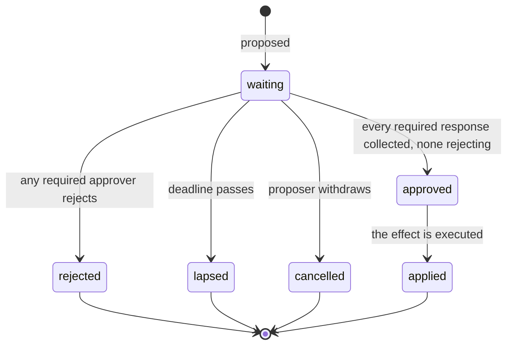
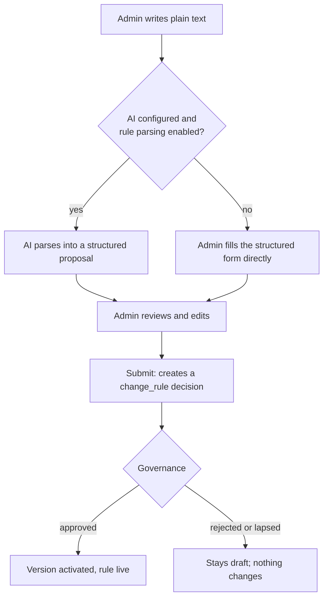
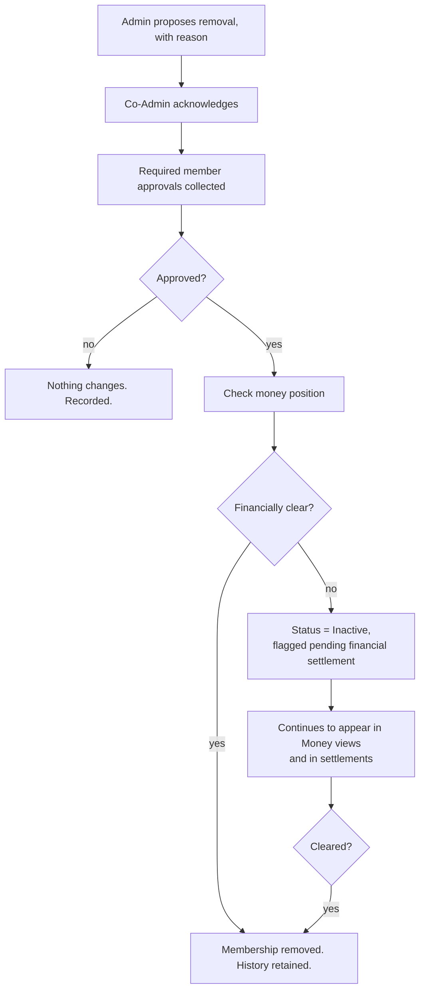
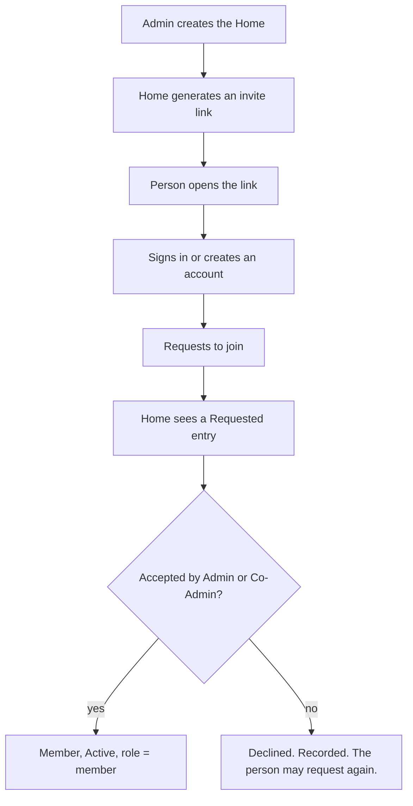

# 14 — Governance, Decisions, Approvals and Rules

**Product:** HouseOS
**Version:** 2.0
**Date:** 2026-08-26
**Depends on:** [01-BRD.md](01-BRD.md) sections 6.2, 6.3, 6.4 and 7

This document specifies the machinery behind every shared decision in a Home:
one Decision engine, one Approval engine, and the Rules module that sits on top
of them. It exists because version 2.0 of the product has eight things that need
somebody else's yes, and eight parallel implementations of "somebody else's yes"
is how a codebase acquires eight subtly different meanings of the word approved.

---

## 1. The three levels

Every action in the product is classified once, in the governance policy, into
one of three levels.

| Level | Requires | Examples |
|-------|----------|----------|
| **1 — Normal** | Nothing beyond the actor's own permission | Log an expense, add a meal, rate a food, mark a chore done, record presence |
| **2 — Important** | An Admin or Co-Admin action, plus member acknowledgement | Operational settings, category changes with financial effect, some member changes |
| **3 — Critical** | Admin, plus Co-Admin, plus the Home's required member approvals or acknowledgements | Close settlement, reopen settlement, balance adjustment, remove a member, create or change a rule, change governance policy, change how chores are confirmed, change Home type or money mode |

Most of what a Home does every day is level 1. That is deliberate and it is the
answer to the obvious objection: governance that touches everything makes an app
nobody can use. The levels exist so the rare, consequential, argument-causing
actions are shared and everything else is not.

---

## 2. Approval versus acknowledgement

The distinction is small, load-bearing, and the single most common thing to get
wrong.

| | Approval | Acknowledgement |
|---|---|---|
| The question asked | "Do you agree this should happen?" | "Do you accept that this is happening?" |
| Responses | `approve` or `reject` | `acknowledge` only |
| Can it stop the action? | Yes. One rejection resolves the decision as `Rejected`. | No. It can only delay it. |
| Used for | Things a person should be able to veto: an absence excuse, an expense, a member removal | Things the Home is entitled to know but not to block: a settlement close it has no grounds to refuse, a rule the Admin is empowered to set |
| Recorded | Actor, response, reason if rejected, timestamp | Actor, timestamp |

Requiring unanimous *approval* for everything is how the product becomes
unusably bureaucratic. Requiring nothing is how it becomes one person's app.
Acknowledgement is the middle, and it carries most of the load in the default
matrix.

---

## 3. The Decision record

One record type backs every shared decision.

```text
Decision
├── id
├── house_id
├── type                    close_settlement | reopen_settlement | remove_member
│                           | change_rule | change_governance | change_home_mode
│                           | balance_adjustment | absence_request | join_request
│                           | expense_approval | chore_confirmation
│                           | set_expected_contribution | create_reserve
│                           | reserve_draw | change_confirmation_policy
├── level                   normal | important | critical
├── requested_by            member id
├── subject_type            the entity kind this decision is about
├── subject_id              the entity it is about
├── payload                 jsonb — what would change, exactly
├── reason                  text, required for critical decisions
├── required_approvals      integer
├── required_acks           integer
├── participants[]          who is required, and in which capacity
├── deadline                timestamptz
├── status                  waiting | approved | rejected | lapsed | applied | cancelled
├── result                  jsonb — what actually changed, written at apply time
├── created_at / resolved_at / applied_at
```

And one child record per response:

```text
DecisionResponse
├── decision_id
├── member_id
├── capacity        approver | acknowledger
├── response        approve | reject | acknowledge
├── reason          required on reject, ≥ 10 characters
├── responded_at
```

### 3.1 The state machine



Two properties that must hold, and are tested as such:

1. **Nothing changes while a decision is `waiting`.** The effect is applied at
   the transition into `applied`, in one transaction, and never before.
2. **`approved` and `applied` are separate states.** A decision can be approved
   and then fail to apply — a settlement close whose balances no longer net to
   zero, a removal whose subject has since left. The record keeps both facts.

### 3.2 Resolution

```
function resolve(decision, responses):
    if any response where capacity = approver and response = reject:
        return rejected

    approvals = count(responses where capacity = approver and response = approve)
    acks      = count(responses where response = acknowledge)

    if approvals >= decision.required_approvals
       and acks >= decision.required_acks
       and every mandatory participant has responded:
        return approved

    if now() > decision.deadline:
        return lapsed

    return waiting
```

`participants` distinguishes **mandatory** from **counting** participants. The
Co-Admin on a settlement close is mandatory: the decision cannot approve without
them, whatever the counts say. A member on the same decision is counting: any
`required_acks` of them will do.

### 3.3 Participant selection

| Decision type | Mandatory | Counting pool | Default requirement |
|---|---|---|---|
| `close_settlement` | Admin (proposer), Co-Admin | Active adult members | acks ≥ ⌈half⌉ |
| `reopen_settlement` | Admin (proposer), Co-Admin | Active adult members | approvals ≥ ⌈half⌉ |
| `remove_member` | Admin (proposer), Co-Admin | Active adult members excluding the subject | approvals ≥ ⌈half⌉ |
| `change_rule` | Admin (proposer), Co-Admin | Active adult members | acks ≥ ⌈half⌉ |
| `change_governance` | Admin (proposer), Co-Admin | Active adult members | acks = all |
| `change_confirmation_policy` | Admin (proposer), Co-Admin | Active adult members | acks = all |
| `change_home_mode` | Admin (proposer), Co-Admin | Active adult members | acks ≥ ⌈half⌉ |
| `balance_adjustment` | Admin (proposer), Co-Admin | the two members affected | approvals = both |
| `absence_request` | — | Admin, Co-Admin | approvals ≥ 1 |
| `join_request` | — | Admin, Co-Admin | approvals ≥ 1 |
| `expense_approval` | — | Active members except the payer | approvals ≥ 1 |
| `chore_confirmation` | quorum, see section 4 | Active members except the assignee | quorum by Home size |
| `set_expected_contribution` | Admin (proposer), Co-Admin | Active adult members | acks ≥ ⌈half⌉ |
| `create_reserve` | Admin (proposer), Co-Admin | Active adult members | approvals ≥ ⌈half⌉ |
| `reserve_draw` | Admin (proposer), Co-Admin | Active adult members | approvals ≥ ⌈half⌉ |

**A Home with no Co-Admin.** The Co-Admin slot is dropped from the mandatory
list and the member requirement rises by one. A two-person Home with no Co-Admin
therefore still cannot have one person complete a Critical decision — the other
person is required. A one-person Home is the documented exception: every Critical
decision auto-approves and is recorded as such, because there is nobody to ask.

**Self-exclusion.** The subject of a decision is never a required participant in
it. A member being removed does not vote on their removal; a payer does not
approve their own expense; a doer does not confirm their own chore. This is
enforced in the database, not only in the resolver.

### 3.4 Deadlines and lapse

Default deadline by type: 7 days for `close_settlement`, `reopen_settlement`,
`remove_member`, `change_rule`, `change_governance`, `change_home_mode`,
`change_confirmation_policy` and
`balance_adjustment`, `set_expected_contribution`, `create_reserve` and
`reserve_draw`; 48 hours for `absence_request` and `join_request`; the
Home's auto-confirm window for `chore_confirmation`; and none for
`expense_approval`, which sits until answered because an unapproved expense
already blocks the close.

A lapsed decision takes no effect and is kept. The proposer may re-propose,
which creates a new decision that references the lapsed one.

Participants are notified when a decision is created, again 24 hours before its
deadline, and once when it resolves (N-40 to N-43 in
[11-NOTIFICATIONS-SPEC.md](11-NOTIFICATIONS-SPEC.md)).

---

## 4. Chore confirmation quorum

Chore confirmation is a decision like any other, with its participants chosen by
Home size. This replaces version 1.0's "any one peer confirms".

| Active adult members | Confirmation required |
|---:|---|
| 1 | Auto-confirmed immediately; nobody to ask |
| 2–3 | One other person |
| 4–6 | An Admin or Co-Admin, plus one other person |
| 7 or more | An Admin or Co-Admin, plus two other people |

Rules that hold at every size:

- **The assignee is never a confirmer.** Database constraint, not application
  logic.
- **A guardian may mark a dependent's chore done and may not confirm it**
  (D-24). The quorum is drawn from everyone else.
- **One rejection ends it.** A rejection within the window stops the quorum
  immediately and sends the chore back for one retry.
- **Auto-confirm still applies at every size.** If the quorum is not reached
  within the Home's window, the chore confirms with `auto_confirmed = true` and
  `confirmed_by` null (D-11). Requiring an Admin's signature without a timeout
  would hand every Admin a veto over everyone's points, which is precisely the
  failure mode design decision 3 exists to prevent.
- **A Family Home may reduce this** to a single acknowledgement or switch it off
  (CE-10). Nobody needs two signatures for a nine-year-old making their bed.
  The setting is `house_settings.confirmation_policy` — `size_aware`, `single`
  or `off` — and the only thing that writes it is an applied
  `change_confirmation_policy` decision. There is no settings screen for it,
  deliberately: deciding to stop checking each other's work is a Critical
  decision the whole Home acknowledges, not an Admin preference (D-60).

The counts are stored per assignment as `confirmations_required`,
`confirmations_received` and `requires_lead_confirmer`, snapshotted when the
chore is marked done. A member joining or leaving between "done" and
"confirmed" does not move the goalposts — the reasoning, and the guardian's ban
on rejecting as well as confirming, are D-58.

---

## 5. Approve All

One control, several safety rules.

```
function approvable(caller, decisions):
    return decisions where
        caller is a required participant
        and caller has not already responded
        and caller is not the subject or the proposer
        and (decision.level < critical
             or every other mandatory participant has already responded)
```

The last clause is the important one. **Approve All never completes a Critical
decision that is still waiting on somebody else.** It contributes the caller's
own response to everything they may legitimately batch, and Critical decisions
that would complete on the caller's tap are excluded from the batch and shown
individually, with their full effect stated, requiring a deliberate action.

Batching a rejection is not offered. A rejection needs a reason, and a batch of
identical reasons is not a reason.

---

## 6. Rules

### 6.1 What a rule is

```text
HomeRule
├── id, house_id
├── title                short, human, shown in the list
├── original_text        exactly what the Admin typed, kept forever
├── parsed_by            manual | ai
├── condition            structured: when this happens
├── action               structured: this should be done
├── applies_to           all | role | named members | room
├── weight_points        integer, nullable
├── penalty_paise        bigint, nullable
├── starts_on / ends_on
├── status               draft | proposed | active | disabled | superseded
├── current_version_id
└── created_by / created_at / updated_at

RuleVersion
├── rule_id, version_no
├── the full snapshot of every field above
├── change_reason
├── decision_id          the governance decision that activated it
├── activated_at / superseded_at
```

### 6.2 The lifecycle



**AI never activates a rule.** It produces `condition`, `action`, `applies_to`
and a suggested weight, marked `parsed_by = 'ai'`, and stops. Every field is
editable before submission, and the submission is a governance decision like any
other. A Home with no AI configured writes the same rule through the form, and
the module works completely.

### 6.3 Worked examples

**Input:**

> "Everyone should clean their own plates before sleeping."

**Proposal:**

```json
{
  "title": "Clean your own plates",
  "condition": { "kind": "time_of_day", "after": "dinner" },
  "action":    { "kind": "task", "text": "Clean own dishes" },
  "applies_to": { "kind": "all" },
  "weight_points": null,
  "penalty_paise": null
}
```

**Input:**

> "If someone does not clean the bathroom on their assigned day, the missed task
> should be rescheduled."

**Proposal:**

```json
{
  "title": "Missed bathroom cleaning reschedules",
  "condition": { "kind": "chore_missed", "template": "Clean bathroom" },
  "action":    { "kind": "reschedule" },
  "applies_to": { "kind": "assignee" },
  "weight_points": null,
  "penalty_paise": null
}
```

**Input:**

> "Nobody should leave unwashed vessels overnight. If someone does it, they must
> clean the kitchen next morning."

**Proposal:**

```json
{
  "title": "Unwashed vessels overnight",
  "condition": { "kind": "state_at_time", "state": "unwashed_vessels", "at": "end_of_day" },
  "action":    { "kind": "task", "text": "Clean the kitchen next morning" },
  "applies_to": { "kind": "responsible_person" },
  "weight_points": null,
  "penalty_paise": null
}
```

The parse is a starting point for a person, not an execution plan. Version 2.0
executes exactly two structured kinds automatically — `chore_missed` →
`reschedule`, and a rule carrying `weight_points` or `penalty_paise` feeding the
effort and settlement engines. Everything else is a rule the Home has written
down, agreed to, and can point at. That is most of the value, and it is honest
about what the system can enforce.

### 6.4 Versioning and history

Rules are never overwritten. Editing an active rule creates the next
`RuleVersion` and a `change_rule` decision; on approval the new version
activates and the old one is stamped `superseded_at`. The rule list shows the
current version; the rule's history answers, for every version:

- who changed it
- when
- the old value and the new value, field by field
- the reason given
- who acknowledged it, and when

Disabling a rule is a version transition too, not a delete. A rule that was in
force in June must still be readable in December, with its June values.

### 6.5 The rules screen

Individually editable, individually disableable, never one blob:

```text
House Rules

✓ Clean dishes after eating                     [Edit] [Disable] [History]
✓ Bathroom cleaned every Sunday                 [Edit] [Disable] [History]
✓ No outside guests after 11 PM                 [Edit] [Disable] [History]
✓ Missed chore carries to next week             [Edit] [Disable] [History]
✓ ₹50 penalty per 10 missed points              [Edit] [Disable] [History]

+ Add a rule
```

### 6.1 Behavioural penalty rules

In addition to chore-linked points and penalties, the Home may define
behavioural rules that carry a money penalty for violations:

```text
✓ No loud music after 11 PM on weekdays            [Edit] [Disable] [History]
  penalty_paise: 20000, applies_to: all_active
✓ Kitchen must be cleaned after cooking             [Edit] [Disable] [History]
  penalty_paise: 5000, applies_to: all_active
```

These rules are recorded and displayed but do not auto-execute. A violation is
reported by a member, confirmed by another, and enters the settlement as a
penalty line. The same governance that protects chore penalties protects these:
the penalty amount is visible, and changing it is a Critical decision.

Behavioural penalty rules differ from chore penalties in that they are not
computed from the effort ledger. They are triggered by a confirmed report, not
by a schedule.

---

## 7. Member removal

The one flow where governance, money and membership meet.



"Financially clear" means: no unsettled settlement rows in either direction, no
approved expense splits in an open period, and no pending balance adjustment.
The check runs at apply time and again whenever a settlement involving that
member is confirmed, so the removal completes on its own without anyone
remembering to come back to it.

An `Inactive` member:

- receives no new chore assignments and no new expense splits
- keeps every past assignment, expense, split, meal and decision response
- remains visible in Members under an "Inactive" section, with their outstanding
  amount stated
- cannot sign into that Home's data — RLS treats non-`active` as a non-member for
  reads, exactly as it treats `requested`

---

## 8. Joining



Rules:

- **There is no admin-creates-member path.** An Admin cannot manufacture an
  account for somebody else. The request comes from the person.
- A `Requested` person has **no role and no permissions**. They see the request
  screen and nothing else. RLS gives them zero rows from every house-scoped
  table.
- The member list shows requests in a muted section, and the details of a request
  are visible only to people permitted to act on it.
- The invite link is revocable and rotatable. Revoking it does not affect
  requests already made.
- A dependent is the exception that proves the rule: they have no account and are
  created by their guardian, because there is nobody to send a link to. They also
  have no permissions at all, which is why this is safe.

---

## 9. Configuration

Stored per Home in a governance policy row, with the section-3.3 defaults.

| Setting | Type | Default |
|---------|------|---------|
| `critical_requires_coadmin` | boolean | true |
| `critical_member_rule` | `count` or `proportion` | proportion |
| `critical_member_value` | integer or percent | 50 |
| `governance_requires_all` | boolean | true — changing governance needs everyone |
| `absence_approvers` | role set | admin, co_admin |
| `join_approvers` | role set | admin, co_admin |
| `expense_approvals_required` | integer | 1 |
| `confirmation_policy` | `size_aware`, `single`, `off` | size_aware |
| `decision_deadline_days` | integer | 7 |
| `absence_deadline_hours` | integer | 48 |

The gamification toggle lives in `house_settings`, not the governance policy,
because it does not affect who decides what. It is toggled by an Admin and
requires Co-Admin acknowledgement (Important, not Critical):

| Setting | Type | Default |
|---------|------|---------|
| `game_layer_enabled` | boolean | false |

When enabled, points, badges and streaks are visible on member profiles and in
the Insights module. When disabled, all gamification data is hidden but
retained — re-enabling does not reset history.

Changing any of these is itself a Critical decision requiring every Active adult
member's acknowledgement (GV-12). A governance policy one person can quietly
loosen is not a governance policy.

---

## 10. Enforcement points

| Guarantee | Where it is enforced |
|-----------|---------------------|
| A decision's effect is not applied before approval | The apply function is `security definer` and refuses any decision not in `approved` |
| The subject of a decision is not a participant in it | Check constraint on `decision_participants` plus the resolver |
| A payer does not approve their own expense | Existing check constraint `no_self_approve` |
| An assignee does not confirm their own chore | Existing check constraint `no_self_confirm`, extended to the confirmation rows |
| A Critical decision cannot complete without its mandatory participants | The resolver, plus a database trigger that refuses the `applied` transition when mandatory responses are missing |
| One rejection resolves the decision | The resolver, evaluated on every response insert |
| Only permitted people respond | RLS on `decision_responses`: insert allowed only where the caller is a listed participant |
| A rule activates only through a decision | `home_rule_versions.decision_id` is not null on any row with `activated_at` set |
| Approve All cannot complete a Critical decision | The route filters before it writes, and the trigger above is the backstop |

Every one of these has a test in
[12-TEST-PLAN.md](12-TEST-PLAN.md) section 3.5. The route-handler checks exist
for good error messages. They are never the only place a rule lives.

---

## 11. What this deliberately does not do

- **No weighted votes, no proxies, no delegation.** A decision needs named
  people to respond. Everything else is a governance rabbit hole with no bottom.
- **No quorum by presence.** Being away does not remove somebody from a decision
  about money they are part of. Deadlines and lapse handle the unresponsive case.
- **No automatic escalation to a majority override.** A Critical decision that
  cannot collect its responses lapses. The Home talks to each other; the app does
  not decide that the silent people would have agreed.
- **No AI participation.** A model does not approve, acknowledge, propose or
  resolve anything. It parses text into a proposal a person then owns.
